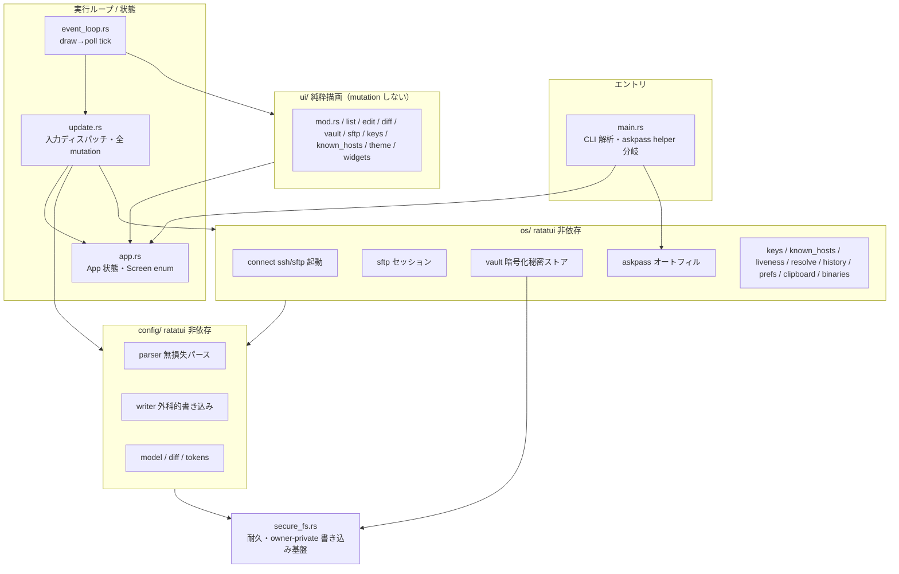
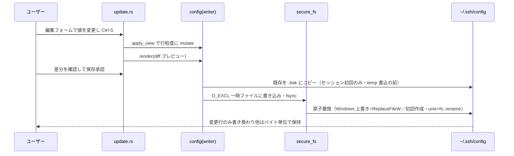

# アーキテクチャ設計（sshm-tui）

システム全体の構成・レイヤリング・技術スタックの真実源。領域別の詳細は各 `docs/design/<領域>.md` に分割する（索引は [`README.md`](./README.md)）。実装の逐次的な作業指示は `CLAUDE.md`「プロジェクト固有情報」節を参照。

## 責務

`~/.ssh/config` を無損失にパース・編集・書き戻し、保存済みホストへ `ssh`/`sftp` で接続する単一バイナリの TUI アプリケーション（クレート `sshm-tui`／バイナリ `sshm`）。秘密（パスワード・パスフレーズ）は暗号化 vault に隔離し、SSH config には決して書かない。

## 構成要素（レイヤリングと一方向依存）

3 層 ＋ 横断基盤で、依存方向を厳格に一方向に保つ（`config/`・`os/` は UI を知らない＝ヘッドレステスト可能）。

| 層 | ディレクトリ | 責務 | ratatui 依存 |
|----|------------|------|:---:|
| ドメイン（config） | `src/config/` | `~/.ssh/config` の無損失パース・外科的書き戻し・差分 | なし |
| ドメイン（os） | `src/os/` | 外部プロセス（ssh/ssh-keygen/sftp）・vault・askpass・到達性・鍵・known_hosts | なし |
| UI | `src/ui/` | 画面ごとの純粋描画（状態を mutate しない） | あり |
| 実行ループ・状態 | `event_loop.rs`・`app.rs`・`update.rs` | draw→poll ループ・中央状態・入力ディスパッチ（全 mutation） | あり |
| 横断基盤 | `secure_fs.rs`・`error.rs` | 耐久・owner-private 書き込み・エラー型 | なし |

## データフロー・主要シーケンス

編集→保存の主要シーケンス（無損失往復と原子置換）:

## 外部依存・インターフェース

- **OpenSSH**（`ssh`・`ssh-keygen`・`sftp`）: PATH（Windows は `System32\OpenSSH` を優先）。sshm 自身が `SSH_ASKPASS` helper を兼ねる。
- **Windows Terminal**（`wt.exe`）: 新規タブ接続時のみ。
- 主要クレート: `ratatui`（TUI）／`argon2`+`chacha20poly1305`+`zeroize`（vault crypto）／`nucleo-matcher`（ファジー検索）／`arboard`（クリップボード）／`dirs`／`serde`／`windows-sys`。詳細は `docs/要件定義書.md`「技術選定」。

## 技術スタックと配置（デプロイ構成）

- 単一クレート・単一バイナリ（`cargo build --release` → `target/release/sshm`）。サーバ・常駐なし。
- 配布: crates.io（`sshm-tui`）・Scoop・winget（`packaging/`）・GitHub Release（`v*` タグ起点の `release.yml`）。
- ローカル状態ファイル（すべて `~/.ssh/` 配下・owner-private）: `config`（真実源）／`sshm-vault.json`（暗号化秘密）／`sshm-prefs.json`（非秘密設定）／`sshm-history.json`（接続履歴）。

## 非機能設計（構成への落とし込み）

- **応答性**: UI スレッドは非ブロック。到達性プローブ・SFTP はワーカースレッド、結果は 200ms tick で `mpsc`/ドレイン。
- **セキュリティ**: 秘密は vault（Argon2id + XChaCha20-Poly1305）に隔離・`Zeroize`・15 分自動ロック。オートフィル解放は System32 信頼ゲート。詳細は security 領域（`docs/design/` に領域追加時）。
- **可搬性**: Windows-first・クロスプラットフォーム。CI（`ci.yml`）が Linux+Windows で fmt/clippy/test/audit。

## 主要な設計判断（現行の理由）

- **実 config を単一の真実源にする**: 独自 DB を持たず `ssh <alias>` で接続 → 他ツールと設定が食い違わない。代償として無損失往復（`render(parse(s))==s`）の維持が最重要不変条件になる。
- **秘密を config から分離**: OpenSSH config に秘密の置き場が無く、平文保存は危険なため、暗号化 vault を独立ファイルに置く。
- **レイヤリングを ratatui 非依存で固定**: ドメインロジックをヘッドレスにテスト可能にするため、`config/`・`os/` から UI に依存しない。
