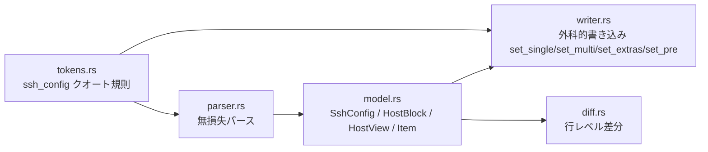

# config 領域 設計（`src/config/`）

> status: draft — 初期骨子。実装の現状に合わせて随時確定（`status: active` へ）する。

## 責務

`~/.ssh/config` を無損失にパースし、外科的（行粒度）に書き戻す。**ratatui 依存ゼロ**でヘッドレステスト可能。最重要かつ最もテストされた層。

## 構成要素

## データフロー・主要シーケンス

`load → host_views（編集用射影）→ apply_view（行粒度 mutate）→ render`。詳細な保存シーケンスは [architecture.md](./architecture.md) を参照。

## ホストメタデータ（タグ・説明）— `# sshm:` ディレクティブ（#45・実装前 draft）

> status: draft の実装前設計。ホスト直上コメント（`HostBlock.pre: Vec<RawLine>`）に **sshm 所有のメタデータ**をコメントで永続化する。「並行 DB を持たない・実ファイルが真実の源泉」という製品思想と両立する。

- **ワイヤーフォーマット（sshm 所有は `# sshm:` 接頭辞行のみ）**:
  - `# sshm:tags <csv>` — カンマ区切りのタグ（`prod,db`）。値の trim・空要素除去。タグ値にカンマは使えない。
  - `# sshm:desc <text>` — 1 行の説明（複数行説明は本 Issue のスコープ外）。
  - **認識規則**: `RawLine.text` の先頭空白を除去 → 先頭 `#` を剥がし trim → `sshm:` で始まるか（`sshm:` とディレクティブ鍵は大小無視）。インデント・`#` 後の空白数に依存しない。**`# sshm:` 接頭辞の無い行（例 `# Managed by Ansible`）はメタデータとして取り込まない**（pre にバイト単位で保持するだけ＝サードパーティコメントの footgun 回避）。
- **パース（読み）**: `from_block` に `block.pre` を走査する第 2 パスを追加（現状は `body` のみ走査）。認識は固定 index ではなく `sshm_directive(&str, key) -> Option<&str>` ヘルパで prefix 認識する（`pre` は 0..N 個の無関係コメントを任意順で含みうるため）。`HostView.tags: Vec<String>` / `HostView.description: Option<String>` に射影。`HostView` の derive `PartialEq/Eq` に自動参加するため `form_is_dirty` は追従する（新フィールドは全構築点で初期化＝`Default` と "add new" フォーム経路）。
- **書き込み（`writer::set_pre`）**: `set_single`/`set_multi` の「変更行のみ書き換え」規律を `&mut Vec<RawLine>` に対して踏襲する新設セッター。
  - **only-rewrite-on-change**: タグ/説明が原本と同値なら `pre` に一切触れない（往復保証）。変更時のみ、既存 `# sshm:*` 行を byte 比較して差分だけ `RawLine.text` を rewrite・不要になった行を削除・新規は `pre` 末尾（Host ヘッダ直上）に挿入。**非 sshm 行はバイト同一・相対順序不変**。
  - `apply_view`（`config/mod.rs`）と `add_host` の両方に `set_pre` 呼び出しを追加する（欠かすとフォーム編集がファイルに届かない）。`delete_host` は `pre` を丸ごと移動するため変更不要（`delete_claims_owned_preceding_comment` テストがガード）。
  - `new_host_block` は `pre: Vec::new()` で始まるため、`set_pre` は空 `pre` への新規挿入も扱う（`set_single` の None 分岐に相当）。
- **不変条件と回帰テスト**: `render(parse(s)) == s`（未編集時・バイト単位）を `set_pre` の only-rewrite-on-change が守る。回帰テストは既存パターンに倣う（`roundtrip_comments_and_blanks` の往復・B1 `edit_extra_option_is_persisted` の「変更は届く」・B5 `edit_unrelated_field_preserves_header_spacing` の「他行はバイト保持」）。特に **タグ編集時に非 sshm コメント・ヘッダ間隔がバイト保持されること**と、**未編集の重複 `# sshm:tags` 行があっても触らないこと**を固定する。

## 外部依存・インターフェース

- `secure_fs.rs`（耐久・owner-private 書き込み）。
- 入力は信頼できないファイル内容。出力は `~/.ssh/config`。

## 主要な設計判断（現行の理由）

- **無損失往復不変条件**: `render(parse(s)) == s`（ユーザーが編集していない部分はバイト単位）。順序付き `Vec<Item>` で各行のインデント・キーワード大小・セパレータ・引数を保持。編集はブロック全体を再レンダせず変更行のみ書き換える。
- **HostView は射影**: フォーム用に平坦化した編集ビュー。専用フィールド外は `HostView::extras` で round-trip（B1 回帰テストが取りこぼしを守る）。
- **クオート規則**: バックスラッシュは非エスケープ（Windows パスがそのまま往復）。リテラル `"` はエスケープ不可のため、含む値は保存を拒否してファイル破壊を防ぐ。
- **メタデータはコメントに置く（並行 DB 無し・#45）**: タグ・説明を `# sshm:` コメントで config 自身に永続化し「実ファイルが真実の源泉」と両立させる。sshm 所有は `# sshm:` 接頭辞行のみ（第三者コメントを説明として書き換える footgun を回避）。**グループは独立概念を持たずタグに集約**（多値タグでグルーピングを表現＝#45 決定）。タグのメタデータはコメント（`RawLine`）に載るため ssh_config のクオート規則の対象外（コメントは自由文）。

> **変更時の検証**: `src/config/` を触ったら `config-roundtrip-guardian` エージェントで不変条件を確認する。
