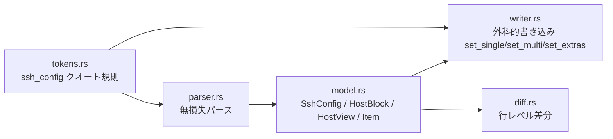

# config 領域 設計（`src/config/`）

> status: draft — 初期骨子。実装の現状に合わせて随時確定（`status: active` へ）する。

## 責務

`~/.ssh/config` を無損失にパースし、外科的（行粒度）に書き戻す。**ratatui 依存ゼロ**でヘッドレステスト可能。最重要かつ最もテストされた層。

## 構成要素

## データフロー・主要シーケンス

`load → host_views（編集用射影）→ apply_view（行粒度 mutate）→ render`。詳細な保存シーケンスは [architecture.md](./architecture.md) を参照。

## 外部依存・インターフェース

- `secure_fs.rs`（耐久・owner-private 書き込み）。
- 入力は信頼できないファイル内容。出力は `~/.ssh/config`。

## 主要な設計判断（現行の理由）

- **無損失往復不変条件**: `render(parse(s)) == s`（ユーザーが編集していない部分はバイト単位）。順序付き `Vec<Item>` で各行のインデント・キーワード大小・セパレータ・引数を保持。編集はブロック全体を再レンダせず変更行のみ書き換える。
- **HostView は射影**: フォーム用に平坦化した編集ビュー。専用フィールド外は `HostView::extras` で round-trip（B1 回帰テストが取りこぼしを守る）。
- **クオート規則**: バックスラッシュは非エスケープ（Windows パスがそのまま往復）。リテラル `"` はエスケープ不可のため、含む値は保存を拒否してファイル破壊を防ぐ。

> **変更時の検証**: `src/config/` を触ったら `config-roundtrip-guardian` エージェントで不変条件を確認する。
