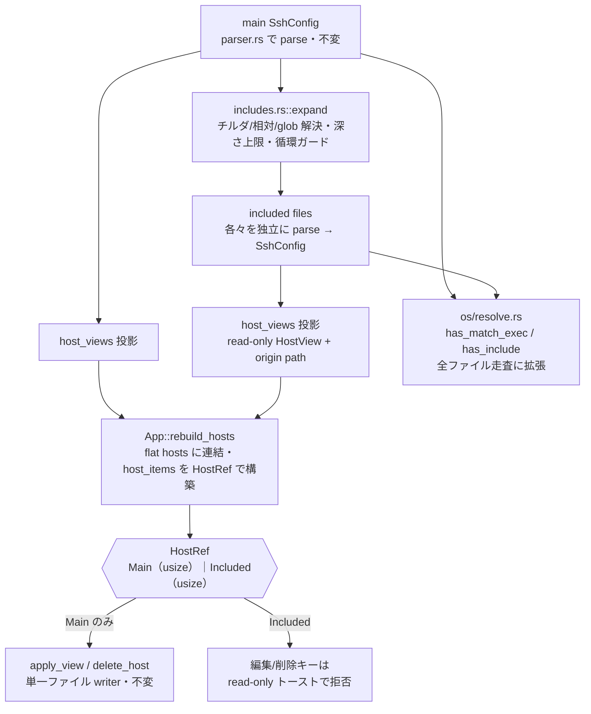
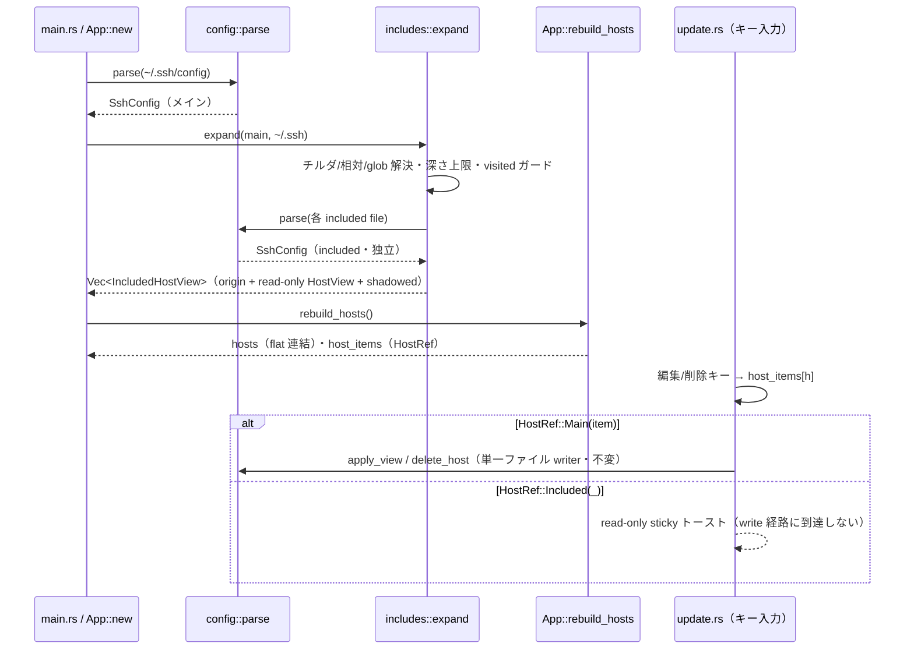

# includes 領域 設計（`src/config/includes.rs` ほか）— #52・実装前 draft

> **状態: draft（実装前設計）**。本領域は Issue #52「Include ディレクティブの展開対応」の **read-only 第 1 段**の設計。実装完了後に現状へ確定し `status: active` にする（`/dev-tasks`「ドキュメント更新」）。**編集対応は別 Issue（第 2 段）に分割**。

## 責務

`~/.ssh/config` の `Include` ディレクティブを**再帰展開**し、分割 config（1Password / Ansible などが生成）のホストも sshm で**一覧・閲覧**できるようにする（read-only）。included ホストは**閲覧専用**で、編集・削除は**メインファイルのホストのみ**に限る。config 層の無損失往復不変条件（`render(parse(s)) == s`）と**単一ファイル外科的 writer 経路は一切変更しない**（included ファイルへは書き込まない）。

## 構成要素



- **`src/config/includes.rs`（新規・ヘッドレス・ratatui 依存ゼロ）**: `expand(main: &SshConfig, base_dir: &Path) -> Vec<IncludedFile>`。
  - **パス解決（OpenSSH セマンティクス）**: チルダ展開（`dirs::home_dir()`、既存依存）。相対パスは **`~/.ssh` 基準**で解決。絶対パスはそのまま。
  - **glob**: `glob` クレート（新規依存）で `Include ~/.ssh/config.d/*` 等を展開（`*`/`?`/`[...]`）。マッチ結果は**辞書順**で安定させる（OpenSSH の読み込み順に近づける）。
  - **深さ上限**: `os/keys.rs` の `MAX_DEPTH = 8` に倣う（included の中の `Include` を再帰追従）。
  - **循環ガード**: 正規化パス（`canonicalize` best-effort・失敗時は正規化前パス）の **visited set** で同一ファイルの再訪を防ぐ。
  - **fail-soft**: 読めない included パス（存在しない・権限なし）はスキップして続行（起動を止めない）。OpenSSH も欠損 Include を致命とはしない。
  - 各 included ファイルは既存 `parser::parse` で独立の `SshConfig` にし、`host_views()` を投影（`HostView::from_block` は pathless なので origin は includes 層が別途持つ）。
- **`App` 状態**: `config: SshConfig`（メイン・**不変**）＋ `included: Vec<IncludedHostView>`（read-only 投影＝`{ origin: PathBuf, view: HostView, shadowed: bool }`）。`host_items: Vec<HostRef>` を新設し、既存の `host_items: Vec<usize>` を置換。
  - `HostRef`（**専用 enum・型で守る**）: `enum HostRef { Main(usize), Included(usize) }`。`Main(item_index)` は `config.items` の index、`Included(k)` は `App::included` の index。**write 経路（`apply_view`/`delete_host`）には `Main` しか渡せない型設計**（Issue の「タプルでなく専用構造体で型を守れ」を直接実装）。
- **`App::rebuild_hosts()`**: メイン `config.host_views()` の HostView と `included` の HostView を **flat `hosts` に連結**し、`host_items` を `HostRef` で並行構築。**liveness/ソート/検索/一覧描画は既存どおり hosts-index（flat 位置）キーのまま変更不要**（included ホストも flat Vec に載るだけ）。
- **編集/削除経路**: `open_edit`（`update.rs`）・delete キー・action menu の Delete が `host_items[h]` を読む箇所を `HostRef` 分岐に変える。`Included` は `Screen::Edit`/`ConfirmAction::DeleteHost` を開かず **sticky トースト**（例:「included host is read-only — edit the source file directly」）で退避。
- **`os/resolve.rs` の安全チェック拡張**: `has_match_exec` / `has_include` / `inspect_block_reason` を**メイン render のみ → 全ファイル（メイン＋included）走査**に広げる。接続時 env-injection ゲート（`update.rs:695`）・SFTP arm ゲート（`update.rs:1999`）・インスペクタ（`update.rs:3039`）が included ファイルの `Match exec` を見逃さないようにする。
- **`ui/list.rs`**: included 行のエイリアス直後に **origin をディム表示**（`⟨config.d/1p⟩` 風・`theme.rs` の色）、shadowed（重複・先勝ちで陰る）行を **`⊘`**。既存の空一覧バナー `include_note`（「hosts in included files are not shown」）は意味を失うので**撤去 or 文言更新**。

## データフロー・主要シーケンス



## 外部依存・インターフェース

- **新規依存**: `glob`（MIT/Apache・メジャークレート）。`cargo-deny`/`cargo audit` ゲートを通す。
- 既存依存: `dirs`（チルダ/home 展開）。
- 入力は**信頼できない**複数ファイル。**included ファイルへは一切書き込まない**（read-only 不変条件）。`expand` は純粋・ヘッドレステスト可能（実 I/O は一時ディレクトリで確認、コアのパス解決/循環/深さは純粋関数化）。

## 主要な設計判断（現行の理由）

- **read-only 先行（2 段階・#52 の強い推奨）**: 「誤ファイルへの外科的書き込み」が最大の事故クラス。read-only 段では included への書き込みが**そもそも発生しない**ため事故クラス自体を回避する。編集対応は別 Issue（第 2 段）。
- **メイン不変＋別 read-only リスト（論点 1 採択）**: 最も実績があり最もテストされた**単一ファイル writer 経路（`apply_view`/`delete_host`/`save`）を無変更**に保つ。included は独立 `SshConfig` を投影した別リストに載せるだけ。編集段 Issue で `App::config` を `Vec<SshConfig>` へ発展させ、そのとき write 経路のリスクを正面からレビューする（今回はその大改修を前倒ししない）。
- **`HostRef` 専用 enum で型を守る**: bare タプル `(file, item)` を避け、`Included` バリアントを write 経路へ**型で渡せない**設計にする（Issue の明示要求）。持ち回り箇所（`Screen::Edit`/`ConfirmAction::DeleteHost`/`PendingSave::Apply`/`host_items` の全変換点）はコンパイラが洗い出す。
- **glob クレート採択（論点 2）**: 主用途（`Include ~/.ssh/config.d/*`）を正しくカバー。自作は `[...]`/複数成分/OpenSSH 挙動との乖離リスクがあるため避ける。
- **インライン origin 表示（論点 3・既存 chip 流儀）**: フラットな**ファジーランク一覧**（`nucleo-matcher`）と hosts-index 位置キーの liveness を崩さないため、ファイル別グルーピングではなくエイリアス直後の**ディム origin** とする（ui.md #45 のタグ chip パターンと一貫）。
- **Match-exec 安全チェックの全ファイル化**: `ssh -G` が honor する included の `Match exec` を接続/SFTP/インスペクタゲートが見逃さないよう全ファイル走査に広げる。ただし本 read-only は**トップレベル Include のみ追従**するため、`ssh -G` が honor しうる**ネスト/クオート splice Include** の残存 blind spot に対しては `has_include` ベースのインスペクタブロック（#43）を**保持**する（安全側）。
- **OpenSSH 先勝ち（first-wins）の表示**: 実接続は素の `ssh <alias>` で OpenSSH 自身が先勝ち解決するため、sshm 側の重複表示（`⊘`）は**情報提供**（挙動を変えない）。

## UI/画面設計（採択案＝インライン origin・ワイヤーフレーム）

```
┌─ Hosts ─────────────────────────────────────┐
│    Alias                 HostName    User    │
│  ● web-prod              10.0.0.1    me      │  ← メイン（編集可）
│  ● db-replica            10.0.0.2    me      │
│  ○ vault ⟨config.d/1p⟩   10.0.1.9    me      │  ← included（origin をディム表示・編集不可）
│  ⊘ vault ⟨work.conf⟩     10.0.1.9    me      │  ← 重複エイリアス（先勝ちで陰る）
└──────────────────────────────────────────────┘
  ●=到達 / ○=未到達 / ⊘=先勝ちで陰る重複。included は origin をディム表示。
  included 行で編集/削除 → 「read-only（元ファイルを直接編集）」sticky トースト。
```

- **状態設計**: 空（Include はあるがホスト 0）・included ファイル読めず（fail-soft でスキップ・トースト任意）・重複（`⊘`）・到達性（●/○/Skipped＝プロキシ経由）。`responsive_split` 縦積み（90 桁未満）では origin を幅に応じて省略。
- **色**: `theme.rs`（Tokyo Night）に集約。origin/`⊘` はハードコードせずアクセント/ディム色。

## 受け入れ条件（AC・read-only・実装前 draft）

> planning ゲートを通していない「機能検討」型 Issue のため、read-only スコープの AC をここで起こす。承認後に Issue #52 本文へ反映する（`/dev-tasks`「AC/DoD 同期」）。

- [ ] Given `Include ~/.ssh/config.d/*` があり included ファイルにホストがある, When 一覧を開く, Then included ホストも一覧に現れ origin（元ファイル）が判別できる
- [ ] Given included ホストを選択, When 編集/削除キーを押す, Then フォームは開かず read-only の sticky トーストが出る（誤ファイル書き込みが構造的に起きない）
- [ ] Given メインと included に同名エイリアス, When 一覧表示, Then OpenSSH 先勝ちを `⊘` で明示する
- [ ] Given 相対パス Include（`Include work/*.conf`）とチルダ（`~/…`）, When 展開, Then ~/.ssh 基準・home 展開で解決される
- [ ] Given 循環 Include（A→B→A）や深いネスト, When 展開, Then visited-set ＋ 深さ上限（8）で無限ループ/暴走しない
- [ ] Given 読めない included パス, When 展開, Then スキップして続行する（起動を止めない・fail-soft）
- [ ] Given included ファイルに `Match exec`, When 接続/SFTP/インスペクタの安全ゲート判定, Then `has_match_exec` が全ファイル走査で安全側に倒す
- [ ] Given included ホスト, When 保存/削除経路が呼ばれうる, Then included ファイルへは一切書き込まない（read-only 不変条件・テストで固定）
- [ ] Given Include が展開された, When 空一覧, Then `include_note` バナー（「表示されません」）を撤去/更新する

## 変更予定ファイル

新規 `src/config/includes.rs`、`src/config/mod.rs`（expand 呼び出し・`include_count` の周辺）、`src/app.rs`（`included`・`HostRef`・`rebuild_hosts`・`host_items` 型）、`src/update.rs`（編集/削除の HostRef 分岐・`has_match_exec` 呼び出し）、`src/os/resolve.rs`（全ファイル走査化）、`src/ui/list.rs`（origin 表示・`include_note`）、`Cargo.toml`（`glob`）。**編集フォーム・writer・vault・askpass は不変**。
