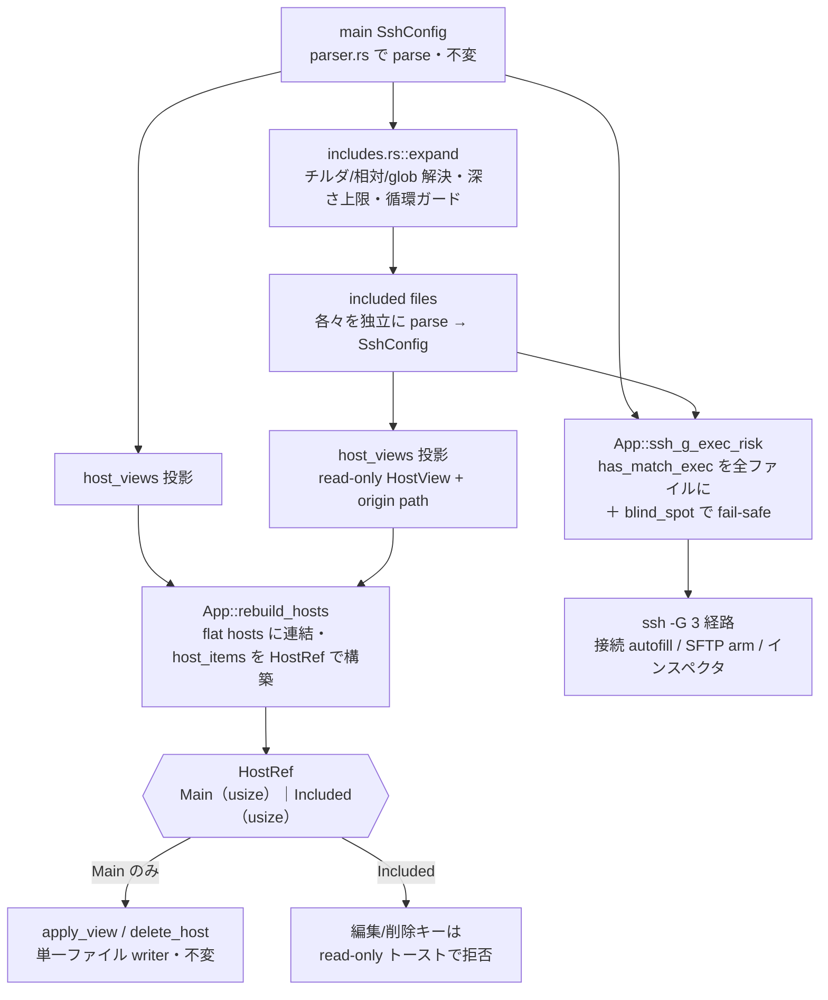
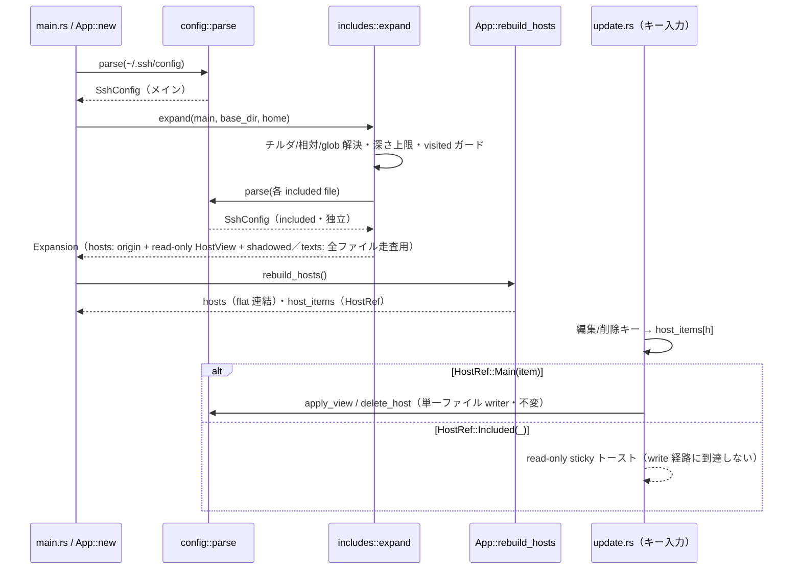

# includes 領域 設計（`src/config/includes.rs` ほか）— #52 read-only 第 1 段

> 本領域は Issue #52「Include ディレクティブの展開対応」の **read-only 第 1 段**（実装済み）。included ホストは一覧・閲覧のみで編集不可。**編集対応は別 Issue（第 2 段）に分割**。

## 責務

`~/.ssh/config` の `Include` ディレクティブを**再帰展開**し、分割 config（1Password / Ansible などが生成）のホストも sshm で**一覧・閲覧**できるようにする（read-only）。included ホストは**閲覧専用**で、編集・削除は**メインファイルのホストのみ**に限る。config 層の無損失往復不変条件（`render(parse(s)) == s`）と**単一ファイル外科的 writer 経路は一切変更しない**（included ファイルへは書き込まない）。

## 構成要素



- **`src/config/includes.rs`（新規・ヘッドレス・ratatui 依存ゼロ）**: `expand(main: &SshConfig, base_dir: &Path, home: &Path) -> Expansion`（`Expansion { hosts: Vec<IncludedHost>, texts: Vec<String> }`）。`texts` は全ファイル走査（`Match exec`）用に、読んだ各 included ファイルの生テキストを保持する（ホスト 0 件のファイルも含む）。
  - **パス解決（OpenSSH セマンティクス）**: チルダ展開（`dirs::home_dir()`、既存依存）。相対パスは **`~/.ssh` 基準**で解決。絶対パスはそのまま。
  - **glob**: `glob` クレート（新規依存）で `Include ~/.ssh/config.d/*` 等を展開（`*`/`?`/`[...]`）。マッチ結果は**辞書順**で安定させる（OpenSSH の読み込み順に近づける）。
  - **深さ上限**: `os/keys.rs` の `MAX_DEPTH = 8` に倣う（included の中の `Include` を再帰追従）。
  - **循環ガード**: 正規化パス（`canonicalize` best-effort・失敗時は正規化前パス）の **visited set** で同一ファイルの再訪を防ぐ。
  - **fail-soft**: 読めない included パス（存在しない・権限なし）はスキップして続行（起動を止めない）。OpenSSH も欠損 Include を致命とはしない。
  - 各 included ファイルは既存 `parser::parse` で独立の `SshConfig` にし、`host_views()` を投影（`HostView::from_block` は pathless なので origin は includes 層が別途持つ）。
- **`App` 状態**: `config: SshConfig`（メイン・**不変**）＋ `included: Vec<IncludedHost>`（read-only 投影＝`{ origin: PathBuf, view: HostView, shadowed: bool }`）。`host_items: Vec<HostRef>` を新設し、既存の `host_items: Vec<usize>` を置換。autofill 安全判定はキャッシュせず接続時に再展開する（下記）。
  - `HostRef`（**専用 enum・型で守る**）: `enum HostRef { Main(usize), Included(usize) }`。`Main(item_index)` は `config.items` の index、`Included(k)` は `App::included` の index。**write 経路（`apply_view`/`delete_host`）には `Main` しか渡せない型設計**（Issue の「タプルでなく専用構造体で型を守れ」を直接実装）。
- **`App::rebuild_hosts()`**: メイン `config.host_views()` の HostView と `included` の HostView を **flat `hosts` に連結**し、`host_items` を `HostRef` で並行構築。**liveness/ソート/検索/一覧描画は既存どおり hosts-index（flat 位置）キーのまま変更不要**（included ホストも flat Vec に載るだけ）。
- **編集/削除経路**: `open_edit`（`update.rs`）・delete キー・action menu の Delete が `host_items[h]` を読む箇所を `HostRef` 分岐に変える。`Included` は `Screen::Edit`/`ConfirmAction::DeleteHost` を開かず **sticky トースト**（例:「included host is read-only — edit the source file directly」）で退避。
- **autofill 安全ゲートの保守的 fail-safe（`app.rs`/`update.rs`）**: `os/resolve.rs` は不変。`App::autofill_config_unsafe()` を新設し、接続時 env-injection ゲートと SFTP arm ゲートが**接続前に呼ぶたび再展開**して判定する（rebuild キャッシュを使わない＝外部ツールが included を書き換えても stale にならない）。判定は「メイン render に `Match exec`」OR「いずれかの included ファイル（lossy 読みで非 UTF-8 も走査）に `Match exec`」OR「`ssh -G` が honor するが expand が追えない include 形式＝`Expansion.blind_spot`」で**安全側に倒す**。`blind_spot` は expand が (a) ブロック内 conditional include (b) クオート splice `"Include"` (c) 深さ `MAX_DEPTH` 超 (d) 評価できない glob パターン（`glob` クレートがエラーにするが libc `glob(3)` は literal として一致させる `[` 等）(e) **解決できない引数形**＝`%d` 等の token・`${ENV}`・`~user/…`（OpenSSH は `GLOB_TILDE` で展開する）・unix のバックスラッシュ（`glob(3)` は `GLOB_NOESCAPE` 無しで `\x`→`x` と解除するため `evil\.conf` は `evil.conf` を読む。Windows では `\` が区切り文字なので対象外）・lossy デコード由来の `U+FFFD` (f) stat/read できない、または通常ファイルでないパス（FIFO 等は**開かず**に退避＝UI スレッドを塞がない）、を検出したとき真。あわせて glob は **`glob(3)` 方言に正規化**してから評価する: `**` は POSIX に無く（単なる `*`）クレートの成分単位 `**` ではフラットな `config.d/**` が 0 件マッチになるため `*` に畳み、`require_literal_leading_dot` で隠しファイル（`ssh` は wildcard で読まない）を除外する。**存在しない include とディレクトリは `ssh` も読めないため `blind_spot` にしない**（一般的な `config.d/*` 構成を過剰ブロックしない）。インスペクタ（#43）も #65 でこのゲートに統合した（下記）。
- **`ui/list.rs`**: included 行のエイリアス直後に **origin をディム表示**（`⟨config.d/1p⟩` 風・`theme.rs` の色）、shadowed（重複・先勝ちで陰る）行を **`⊘`**。既存の空一覧バナー `include_note`（「hosts in included files are not shown」）は意味を失うので**撤去 or 文言更新**。

## データフロー・主要シーケンス



## 外部依存・インターフェース

- **新規依存**: `glob`（MIT/Apache・メジャークレート）。`cargo-deny`/`cargo audit` ゲートを通す。
- 既存依存: `dirs`（チルダ/home 展開）。
- 入力は**信頼できない**複数ファイル。**included ファイルへは一切書き込まない**（read-only 不変条件）。`expand` は純粋・ヘッドレステスト可能（実 I/O は一時ディレクトリで確認、コアのパス解決/循環/深さは純粋関数化）。

## 主要な設計判断（現行の理由）

- **read-only 先行（2 段階・#52 の強い推奨）**: 「誤ファイルへの外科的書き込み」が最大の事故クラス。read-only 段では included への書き込みが**そもそも発生しない**ため事故クラス自体を回避する。編集対応は別 Issue（第 2 段）。
- **メイン不変＋別 read-only リスト（論点 1 採択）**: 最も実績があり最もテストされた**単一ファイル writer 経路（`apply_view`/`delete_host`/`save`）を無変更**に保つ。included は独立 `SshConfig` を投影した別リストに載せるだけ。編集段 Issue で `App::config` を `Vec<SshConfig>` へ発展させ、そのとき write 経路のリスクを正面からレビューする（今回はその大改修を前倒ししない）。
- **`HostRef` 専用 enum で型を守る**: bare タプル `(file, item)` を避け、`Included` バリアントを write 経路へ**型で渡せない**設計にする（Issue の明示要求）。持ち回り箇所（`Screen::Edit`/`ConfirmAction::DeleteHost`/`PendingSave::Apply`/`host_items` の全変換点）はコンパイラが洗い出す。
- **glob クレート採択（論点 2）**: 主用途（`Include ~/.ssh/config.d/*`）を正しくカバー。自作は `[...]`/複数成分/OpenSSH 挙動との乖離リスクがあるため避ける。（**安全上の要点**: Rust `glob` と OpenSSH の libc `glob(3)` はマッチ集合が乖離しうる。特に `glob` が**パターンエラーにする**形〔不均衡な `[` 等〕を `glob(3)` は literal として一致させるため、「評価できなかった」を「0 件マッチ」と混同すると ssh だけが読むファイルの `Match exec` を取りこぼす＝#65 の security-reviewer が実証した bypass。現在は評価不能なパターン・走査中エラーを `blind_spot` に倒し、`**` の畳み込みと `require_literal_leading_dot` で方言差も吸収している。**glob に到達する前**の乖離（バックスラッシュ解除・`~user`・`%`/`${}`・lossy 由来 `U+FFFD`）と、**両者が正常評価しつつ集合が異なる既知の文字クラス方言**（`[^…]`＝クレートは `^` をリテラル扱い／POSIX は否定、`[[:alpha:]]`＝クレートは POSIX クラス非対応）は `is_unresolvable_arg` が fail-safe で捕捉する。残存は未知の方言差のみ。**原理的な残存**として、システム全体の config（`/etc/ssh/ssh_config`・root 所有＝脅威モデル外）と、走査→`ssh -G` 起動間および `stat`→`read` 間の TOCTOU が残る。)
- **インライン origin 表示（論点 3・既存 chip 流儀）**: フラットな**ファジーランク一覧**（`nucleo-matcher`）と hosts-index 位置キーの liveness を崩さないため、ファイル別グルーピングではなくエイリアス直後の**ディム origin** とする（ui.md #45 のタグ chip パターンと一貫）。
- **autofill 安全ゲートは保守的 fail-safe（read-only の要）**: `ssh -G` が honor する `Match exec` は autofill 時に predicate を実行してしまうため、接続/SFTP autofill ゲートは**完全にスキャンできない include 形式（ブロック内 conditional・クオート splice・深さ超）があれば autofill を無効化**する（`autofill_config_unsafe` の `blind_spot`）。expand は listing 用にトップレベル Include のみ追従するが、**安全ゲートは追えない形式を「安全」と仮定せず fail-safe に倒す**（listing の網羅性と安全判定を分離＝security-reviewer 指摘への対応）。主流のトップレベル `config.d/*` は完全走査できるため autofill は維持され、exotic な config だけ手動パスワードにフォールバックする。ゲートは接続前に再展開して stale を避け、included テキストは lossy 走査で非 UTF-8 ファイルも見る。残る blind spot（同一ファイル内でトップレベル include と別のクオート include が混在する等の非現実的ケース）は over-block 側に倒れる（安全）。
- **`ssh -G` ゲートの 3 経路統一（#65）**: 接続 autofill・SFTP arm・実効設定インスペクタ（#43）はいずれも `ssh -G` を実行し、`Match exec` があれば predicate を走らせる経路。#52 の精緻な走査を共有ヘルパー **`App::ssh_g_exec_risk() -> Option<&'static str>`**（安全なら `None`、危険なら理由文字列）に集約し、3 経路すべてがこれを通す。判定順は fail-safe に **① メイン render の `has_match_exec` → ② included ファイル（lossy 読み）の `has_match_exec` → ③ `blind_spot`**。`autofill_config_unsafe()` は `ssh_g_exec_risk().is_some()` の薄いラッパとして残し、接続/SFTP 側は真偽値で読める形を保つ。インスペクタの保守的な `has_include` 一律ブロックはこのゲートに置換し、superseded になった `os/resolve.rs::inspect_block_reason` / `has_include` は**削除**した（削除テストのうち `=`区切り・コメント行・include lookalike の偽陽性ガードは includes 層へ移設し、クオート splice・ブロック内ネストは既存の `blind_spot_on_*` テストが継続してカバーする）。ゲートは**メインファイルもディスクから読み直して**走査し（`ssh -G` が読むのはディスク上のファイル。in-memory render も union で走査＝未保存編集を過剰側に倒す）、外部ツールがメイン config に `Include` を足した場合もそれを追従する。**`--config <path>` 対応**: production の `ssh -G` は `-F` を渡さない＝常に `~/.ssh/config` を読むため、ゲートは**読み込んだ config と既定 `~/.ssh/config` の両方をルートとして走査**する（どちらかが危険なら退避）。システム全体の config（`/etc/ssh/ssh_config`）は root 所有で本脅威モデル外として走査しない。**残存レース**: 走査と `ssh -G` 起動の間に config を書き換えられる TOCTOU はプロセス外ゲートの原理的な限界（窓を狭めるだけ）。これで benign な `config.d/*` でも**インスペクタが開ける**ようになり（実 `Match exec` / 追えない include 形式では 3 経路とも安全に退避）、#65 が指摘した経路間の非対称（インスペクタだけ `has_include` ブロック）を解消した。
- **OpenSSH 先勝ち（first-wins）の表示**: 実接続は素の `ssh <alias>` で OpenSSH 自身が先勝ち解決するため、sshm 側の重複表示（`⊘`）は**情報提供**（挙動を変えない）。

## UI/画面設計（採択案＝インライン origin・ワイヤーフレーム）

```
┌─ Hosts ─────────────────────────────────────┐
│    Alias                 HostName    User    │
│  ● web-prod              10.0.0.1    me      │  ← メイン（編集可）
│  ● db-replica            10.0.0.2    me      │
│  ○ vault ⟨config.d/1p⟩   10.0.1.9    me      │  ← included（origin をディム表示・編集不可）
│  ⊘ vault ⟨work.conf⟩     10.0.1.9    me      │  ← 重複エイリアス（先勝ちで陰る）
└──────────────────────────────────────────────┘
  ●=到達 / ○=未到達 / ⊘=先勝ちで陰る重複。included は origin をディム表示。
  included 行で編集/削除 → 「read-only（元ファイルを直接編集）」sticky トースト。
```

- **状態設計**: 空（Include はあるがホスト 0）・included ファイル読めず（fail-soft でスキップ・トースト任意）・重複（`⊘`）・到達性（●/○/Skipped＝プロキシ経由）。`responsive_split` 縦積み（90 桁未満）では origin を幅に応じて省略。
- **色**: `theme.rs`（Tokyo Night）に集約。origin/`⊘` はハードコードせずアクセント/ディム色。

## 受け入れ条件（AC・read-only・実装済み）

> planning ゲートを通していない「機能検討」型 Issue のため read-only スコープの AC をここで起こし、Issue #52 本文（コメント）へ反映済み。テストは `config::includes`（12 件）＋統合 3 件でカバー。

- [x] Given `Include ~/.ssh/config.d/*` があり included ファイルにホストがある, When 一覧を開く, Then included ホストも一覧に現れ origin（元ファイル）が判別できる
- [x] Given included ホストを選択, When 編集/削除キーを押す, Then フォームは開かず read-only の sticky トーストが出る（誤ファイル書き込みが構造的に起きない）
- [x] Given メインと included に同名エイリアス, When 一覧表示, Then OpenSSH 先勝ちを `⊘` で明示する
- [x] Given 相対パス Include（`Include work/*.conf`）とチルダ（`~/…`）, When 展開, Then ~/.ssh 基準・home 展開で解決される
- [x] Given 循環 Include（A→B→A）や深いネスト, When 展開, Then visited-set ＋ 深さ上限（8）で無限ループ/暴走しない
- [x] Given 読めない included パス, When 展開, Then スキップして続行する（起動を止めない・fail-soft）
- [x] Given included ファイルに `Match exec`（トップレベル・ブロック内・クオート splice・深さ超のいずれの include 経由でも）, When 接続/SFTP autofill の安全ゲート判定, Then `autofill_config_unsafe` が検出 or `blind_spot` fail-safe で autofill を無効化する
- [x] Given included ホスト, When 保存/削除経路が呼ばれうる, Then included ファイルへは一切書き込まない（read-only 不変条件・テストで固定）
- [x] Given Include が展開された, When 空一覧, Then `include_note` バナー文言を更新する

## 変更したファイル

新規 `src/config/includes.rs`（`expand`／`Expansion.blind_spot`／position-aware shadow／lossy 読み）、`src/config/mod.rs`（`pub mod includes`）、`src/app.rs`（`HostRef`・`included`・`rebuild_hosts`・`expand_includes`・`autofill_config_unsafe`・`toast_included_readonly`）、`src/update.rs`（編集/削除/identity の HostRef 分岐・2 つの autofill ゲートを `autofill_config_unsafe` に）、`src/ui/list.rs`（origin 表示・`⊘`・`include_note` 文言）、`Cargo.toml`/`Cargo.lock`（`glob`）。**`os/resolve.rs`・編集フォーム・writer・vault・askpass は不変**。
