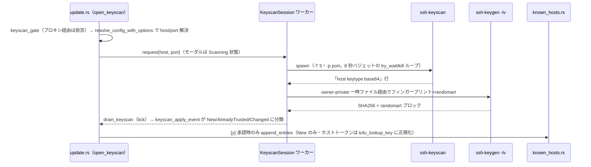

# os 領域 設計（`src/os/`）

> status: draft — 初期骨子。実装の現状に合わせて随時確定する。

## 責務

外界との統合すべて（外部プロセス・ネットワーク・鍵ツール・秘密ストア）。**ratatui 依存ゼロ**。秘密・信頼境界を扱う vault/askpass は [security.md](./security.md) に分離。

## 構成要素

| モジュール | 責務 |
|-----------|------|
| `connect.rs` | `ssh`/`sftp` の起動（保存済みは `ssh <alias>`、override 時のみフラグ発行）・`wt.exe` 新規タブ |
| `sftp.rs` | `ls -l` 一覧パース ＋ ライブ `SftpSession` browse ワーカー（短命 `sftp -b`・circuit-breaker） |
| `keys.rs` | `~/.ssh` 再帰探索（最初のヘッダ行のみ sniff）・フィンガープリントで公開/秘密をペアリング |
| `known_hosts.rs` | 解析・内容アドレスでの削除（`.old` バックアップ）・スキャン結果の追記 `append_entries`（CRLF/末尾改行を保存・原子的置換） |
| `keyscan.rs`（#46） | `ssh-keyscan` によるホスト鍵の事前スキャン。`KeyscanSession`（thread＋`mpsc`・tick drain）で実行し、取得行を `secure_fs` の owner-private 一時ファイル経由で `ssh-keygen -lv -f` に渡してフィンガープリント＋randomart 化。純粋部（`keyscan_args`・`parse_keyscan_output`・`parse_keygen_lv_output`・`pinned_lines`・`classify_key`）はプロセス起動を伴わずテスト可能 |
| `liveness.rs` | ワーカースレッドプールで TCP 到達性プローブ・`mpsc` 報告・`App::hosts` index キー |
| `resolve.rs` | `ssh -G` による設定解決 |
| `history.rs`・`prefs.rs` | 非秘密の平 JSON（接続履歴・オートフィル opt-in） |
| `binaries.rs`・`clipboard.rs` | ツール探索（System32 優先）・クリップボード |
| `vault.rs`・`askpass.rs` | 暗号化秘密ストア・接続時オートフィル（→ [security.md](./security.md)） |

## データフロー・主要シーケンス

到達性プローブ: UI スレッドは tick ごとに `App::drain_liveness()` を呼ぶだけ（非ブロック）。プロキシ経由（`is_proxied`）は `Skipped`。

ホスト鍵の事前スキャン（#46・keyscan → ピン留め）:

キーレスポンスは `keyscan_handle_key`（純粋）が決める: `y`＝`New` 鍵だけを追記して閉じる／`Esc`＝どの状態でも無追記で閉じる。`Changed`（HOST KEY CHANGED）は承認しても書き込まれない。

## 外部依存・インターフェース

- OpenSSH（`ssh`/`ssh-keygen`/`sftp`）・`wt.exe`（Windows 新規タブ）。
- `config/`（接続対象の解決に `HostView` を参照）。

## 主要な設計判断（現行の理由）

- **config を接続の真実源に**: 保存済みは `ssh <alias>` で OpenSSH に config を読ませる（ProxyJump/forwards/IdentityFile が自動適用）。
- **秘密鍵本体を読まない**: 鍵ペアリングは公開フィンガープリント照合のみ。暗号化 PEM は `Unverified`（エラーにしない）。
- **liveness index キーの脆さ**: ホスト追加/削除で index がずれるため `rebuild_hosts()` が liveness マップをクリアし再プローブ。
- **keyscan は専用ワーカー（#46）**: keyscan は数秒かかるため UI スレッドで実行しない。`SftpSession::request` 型（thread＋`mpsc`・tick drain・`is_finished` reap）を踏襲する。liveness プールはジョブ型・ホスト index キーが固定で不適合、同期実行は `draw()` をブロックするため不採用。バジェットは二重（keyscan 自身の `-T 5` ＋ 8 秒の wall-clock kill）で、前者が通常経路・後者は wedge した子プロセスの backstop。
- **ピン留めのホストトークンは `tofu_lookup_key` の出力に書き換え（#46）**: ゲート判定 `is_host_known`（`ssh-keygen -F`）と確実に一致させるため、keyscan の出力行のホスト部を `HostKeyAlias` 優先／非 22 番ポート `[host]:port` の検索キーに正規化して追記する。追記はプレーン形式（ハッシュ化しない）。
- **分類はホスト照合を OpenSSH に委ねる（#46）**: 既存ピンの取得は `matching_known_entries`（`ssh-keygen -F` を `ssh -G` が報告したファイル集合に対して実行）で行い、ホストトークンの自前比較はしない。**当初はプレーン行のみを自前照合していたが、これはハッシュ化エントリ（`HashKnownHosts yes`＝Debian/Ubuntu 既定）・カスタム `UserKnownHostsFile`・ワイルドカード・大小差をすべて取りこぼし、CHANGED 鍵を `[new]` と表示する fail-open だった**（実 OpenSSH で再現確認済み）。信頼ゲート `is_host_known` と同じ機構・同じファイル集合を使うことが正しさの条件。
- **既にピンのあるホストには追記しない（#46）**: ピン留めできるのは真正なピンが 1 つも無いホストだけ（`pin_block`）。`ssh-keyscan` は秘密鍵の保有を検証しないため、スキャン結果からは攻撃者と正直なサーバを区別できない — 証拠ベースの判定は成立しない（根拠は `docs/design/security.md`）。
- **`append_entries` は追記のみ（#46）**: 既存ファイルの CRLF/LF を踏襲し末尾改行を補ったうえで、`O_APPEND` で末尾だけに書く。全文書き換え（temp＋rename）は、読んだ直後のスナップショットを公開して他プロセスの追記を巻き戻すうえ、Windows では delete-before-rename の窓と宛先 ACL の消失を生むため採らない。
