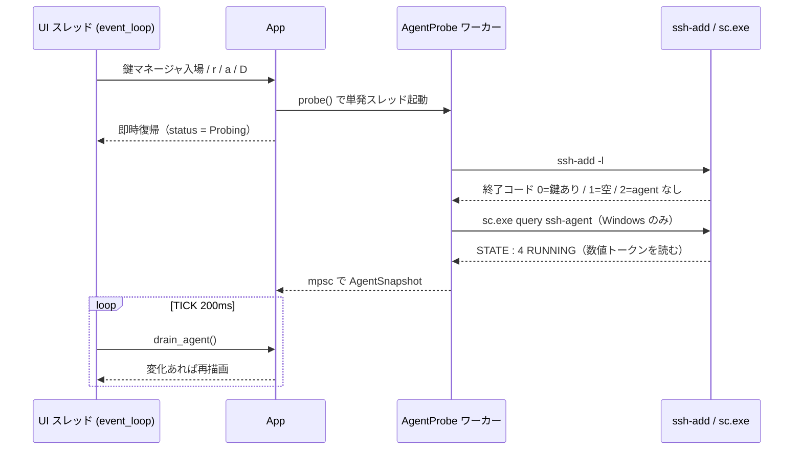

# os 領域 設計（`src/os/`）

> status: draft — 初期骨子。実装の現状に合わせて随時確定する。

## 責務

外界との統合すべて（外部プロセス・ネットワーク・鍵ツール・秘密ストア）。**ratatui 依存ゼロ**。秘密・信頼境界を扱う vault/askpass は [security.md](./security.md) に分離。

## 構成要素

| モジュール | 責務 |
|-----------|------|
| `connect.rs` | `ssh`/`sftp` の起動（保存済みは `ssh <alias>`、override 時のみフラグ発行）・`wt.exe` 新規タブ |
| `sftp.rs` | `ls -l` 一覧パース ＋ ライブ `SftpSession` browse ワーカー（短命 `sftp -b`・circuit-breaker） |
| `keys.rs` | `~/.ssh` 再帰探索（最初のヘッダ行のみ sniff）・フィンガープリントで公開/秘密をペアリング |
| `known_hosts.rs` | 解析・内容アドレスでの削除（`.old` バックアップ） |
| `liveness.rs` | ワーカースレッドプールで TCP 到達性プローブ・`mpsc` 報告・`App::hosts` index キー |
| `agent.rs` | ssh-agent 連携（#49）: `ssh-add -l` の**終了コード**から `AgentStatus` を構築・`sc.exe` のサービス状態パース・`AgentProbe`（単発スレッド＋`mpsc`）・`ssh-add` 引数構築 |
| `resolve.rs` | `ssh -G` による設定解決 |
| `history.rs`・`prefs.rs` | 非秘密の平 JSON（接続履歴・オートフィル opt-in） |
| `binaries.rs`・`clipboard.rs` | ツール探索（System32 優先）・クリップボード |
| `vault.rs`・`askpass.rs` | 暗号化秘密ストア・接続時オートフィル（→ [security.md](./security.md)） |

## データフロー・主要シーケンス

到達性プローブ: UI スレッドは tick ごとに `App::drain_liveness()` を呼ぶだけ（非ブロック）。プロキシ経由（`is_proxied`）は `Skipped`。

ssh-agent プローブ（#49）: 鍵マネージャ入場・`r` リロード・ロード/アンロード後にトリガし、tick ごとに `App::drain_agent()` で回収する。**UI スレッドは決してブロックしない**（Windows で ssh-agent サービスがハングしても描画は回り続ける）。

鍵のロード（`a`）: `os/connect.rs` の `run_inline` を再利用し、TUI をサスペンドして stdio 継承で `ssh-add` を走らせる。**パスフレーズのプロンプトは OpenSSH 自身が TTY に出す**（sshm は秘密を一切保持・中継しない）。復帰後にプローブを再トリガしてバッジを更新する。アンロード（`D`）は入力を要さないが、経路の一貫性のため同じく `run_inline` を通す。

### 主要な型（実装）

| 型 | 意味 |
|----|------|
| `AgentStatus` | `Probing` / `Running(HashSet<String>)` / `NotRunning` / `Unavailable` |
| `KeyAgentState` | `Loaded` / `NotLoaded` / `Unknown`（フィンガープリント不明）/ `NoAgent`（agent 側が未回答） |
| `ServiceState` | `Running` / `Stopped` / `Transitioning` / `Unknown` |
| `AgentSnapshot` | `status` ＋ `service: Option<ServiceState>`（**`None` = そもそも該当しない**＝非 Windows。`Unknown` とは別） |

純粋関数（`status_from_exit`・`parse_loaded_fingerprints`・`key_state`・`parse_service_state`・`snapshot_from`・`load_args`・`unload_args`）と、それらに実出力を与えるだけの薄い spawn 層（`AgentProbe`・`probe_now`・`query_service_state`）に分けてある。**`parse_service_state` を `#[cfg(windows)]` で囲っていない**のは意図的で、そうすると Linux CI でパーサのテストが 1 件も走らなくなるため（Windows 固有なのは spawn だけ）。

## 外部依存・インターフェース

- OpenSSH（`ssh`/`ssh-keygen`/`sftp`）・`wt.exe`（Windows 新規タブ）。
- `config/`（接続対象の解決に `HostView` を参照）。

## 主要な設計判断（現行の理由）

- **config を接続の真実源に**: 保存済みは `ssh <alias>` で OpenSSH に config を読ませる（ProxyJump/forwards/IdentityFile が自動適用）。
- **秘密鍵本体を読まない**: 鍵ペアリングは公開フィンガープリント照合のみ。暗号化 PEM は `Unverified`（エラーにしない）。
- **liveness index キーの脆さ**: ホスト追加/削除で index がずれるため `rebuild_hosts()` が liveness マップをクリアし再プローブ。
- **agent 状態は終了コードで見分ける（#49）**: `ssh-add -l` の 0=鍵あり／1=鍵なし／2=agent 未到達 を `AgentStatus` に写す。メッセージ文字列（"The agent has no identities."）は**ロケール・実装で揺れる**ため読まない。`ssh-add` 自体が解決できない場合は `Unavailable`（`NotRunning` とは別状態＝利用者への案内が変わる）。
- **サービス状態も数値トークンで読む（#49・Windows）**: `sc.exe query ssh-agent` の `STATE : 4 RUNNING` から**数値 4** を読み、後続の語は無視する。ロケールに限らず語が変わっても壊れない。ただし行の**特定**は ASCII のフィールド名 `STATE` に依存しており、これが本設計で唯一未検証の前提（`sc.exe` はフィールド名を翻訳しない一方、`net start`・`Get-Service` は翻訳する、という理解に基づく。本リポジトリの CI に Windows 機が無く確認できていない）。前提が崩れた場合の結果は `Unknown`＝「分からない」であって誤った状態ではない。ja-JP 実機の `sc query ssh-agent` 出力をフィクスチャとして採取するのが本筋。
- **ロード済み判定は fingerprint 突合（#49）**: `ssh-add -l` の各行を既存の `parse_fingerprint_line` で解析し、SHA256 公開フィンガープリントを `KeyInfo.fingerprint` と突き合わせる。**パス一致では判定しない**（agent は鍵の出所パスを保持しないため）。フィンガープリントが読めない鍵（`KeyInfo.fingerprint` が空＝`read_fingerprint` が失敗した暗号化 PEM 等）は「未ロード」ではなく **`Unknown`** として表示する（偽の "未ロード" を出さない）。この判定は agent の状態より**先**に行う: 健全な agent に対してもフィンガープリント無しでは所属を決められないため。
- **`ssh_add` も System32 優先で解決する（#49）**: `SshTools` に `ssh_add` を足し、`ssh` と同じディレクトリから引く。bare PATH から引くと Git/MSYS の `ssh-add` が接続に使う System32 の `ssh` とは**別の agent** を指しうるため、バッジが実際の接続と無関係な agent を説明してしまう。
- **サービス起動は行わない（#49）**: 停止/無効の ssh-agent サービスの起動には昇格が要る。sshm は状態表示と案内文に留め、`sc.exe start` も UAC 昇格も呼ばない。**定期プローブは持たない**ため、外部でサービスを起動しても表示は自動では変わらない — 再確認は `r`（または鍵マネージャへの再入場）。プローブのトリガは 3 箇所のみ（`K` での入場・`r`・load/unload 後）で、tick は drain するだけ。
- **案内文は「停止」と「無効」の両方を賄う（#49）**: 素の Windows は ssh-agent を **Disabled** で出荷し、`sc query` は無効なサービスも `STATE : 1 STOPPED` と報告する（start type は出さない＝両者を区別できない）。`Start-Service` だけを案内すると最頻ケースで «Cannot start service» に落ちるため、`Set-Service -StartupType Automatic` → `Start-Service` の 2 段を出す。
- **`sc.exe` も絶対 System32 パスで起動する（#49）**: `secure_fs` の `icacls_path()` と同じ CWE-426 対策。Rust の Windows 実行ファイル解決は **exe 自身のディレクトリを System32 より先に探す**ため、可搬配置（Scoop・zip 展開）の `sshm.exe` の隣に置かれた `sc.exe` が鍵マネージャを開くたびに実行されうる。`system_directory()` で解決できなければ問い合わせ自体を諦める。
- **単発スレッド＋mpsc（#49）**: ジョブが 1〜2 件のため `LivenessProbe` のワーカープールは再利用せず、`drain` 契約だけを揃えた単発スレッドにする（安定した既存モジュールを 2 ジョブのために一般化しない）。同期呼び出しは採らない — ハングしたサービスが描画ループを止めるため。
- **vault 連携はこの Issue の範囲外（#49）**: 鍵→パスフレーズの逆引きは `VaultEntry`（`host` + `SecretKind` キー）と鍵パスのスキーマ不一致を伴い、0 件/複数件の曖昧さに独立したフェイルセーフ設計が要る。`SSH_ASKPASS_REQUIRE=force` の OpenSSH 8.4+ バージョンゲートも同様。両者は別 Issue に分割し、本 Issue は agent 連携の骨格（状態・ロード/アンロード）を安定させることに絞る。
