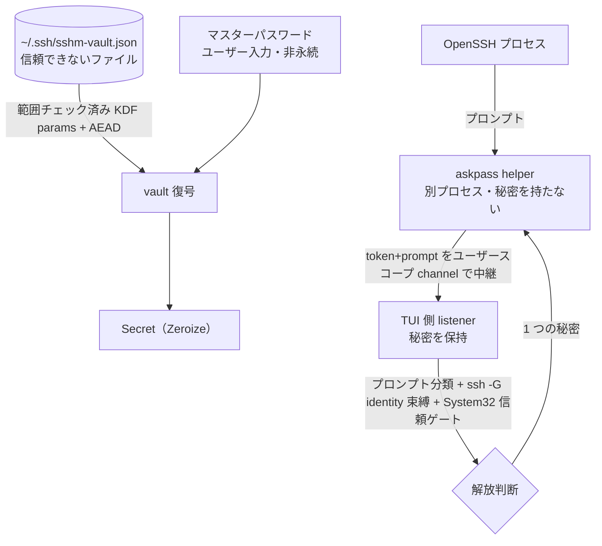

# security 領域 設計（vault・askpass・信頼境界）

> status: draft — 初期骨子。本プロジェクトの中核。`security-reviewer`／`windows-first-reviewer` が実装との整合をこの記述と照合する。

## 責務

秘密（ログインパスワード・鍵パスフレーズ）を SSH config から隔離し、暗号化して保存・接続時に安全に解放する。関連実装は `os/vault.rs`・`os/askpass.rs`・`secure_fs.rs`。

## 信頼境界（外部入力がどこを通るか）

## 秘密の解放判断（認可の代替＝単一ユーザーのため役割表ではなく解放条件表）

**共通ゲート（password・passphrase の両方に必須。1 つでも不成立なら解放しない）:**

| 条件 | 要求 |
|------|------|
| OpenSSH クライアントが `System32\OpenSSH` 由来か | `is_system32`（`GetSystemDirectoryW` で解決） |
| プロンプトの分類（password / passphrase） | `SecretKind` に一致 |
| 解決した identity（`ssh -G`）と vault エントリの束縛 | 一致 |
| vault がアンロック済みか | マスターパスワードで復号済み |

**種別ごとの consent（`decide()` の分岐。ここが password と passphrase で異なる）:**

| 秘密の種別 | consent 要求 | 実装 |
|-----------|------------|------|
| **ログインパスワード** | **2 層 consent（両方必須）**: ①永続 opt-in（`prefs.rs` の `password_autofill_enabled`）＋②per-target 同意（`update.rs` の `confirmed_password_targets` モーダル承認）。加えて override のユーザー変更ガード・OpenSSH<8.5 分離・`Match exec` degrade 等の password 固有ゲート | `prefs.rs` / `update.rs` / `askpass.rs` |
| **鍵パスフレーズ** | **consent 非依存＝ローカル限定で常時有効**（`askpass.rs`「passphrase auto-fill is local-only and stays enabled」）。opt-in を見ず、identity 一致と per-path single-shot のみ判定 | `askpass.rs` の `decide()` Passphrase 分岐 |

## ホスト鍵の事前ピン留め（keyscan・#46）と TOFU の正直さ

- **ピン留めが `is_known` ゲートを満たす正規経路**: `connect_plan` の「host key not yet trusted」blanket ゲート（autofill の前提条件）は**変更しない**。keyscan によるピン留めで known_hosts にエントリが入ることでゲートが自然に通る（ゲート緩和ではなくデータ側の充足）。ピン留め行のホストトークンは `tofu_lookup_key` の出力に正規化するため、ゲートが引く `ssh-keygen -F` の検索キーと必ず一致する。
- **帯域外検証ではないことを偽らない**: keyscan は接続と同じ経路でのスキャンであり、MITM 下では同じ偽鍵を掴む。モーダルは常に「信頼できる情報源（サーバコンソール・プロバイダのドキュメント等）とフィンガープリントを照合せよ」と提示し、randomart＋SHA256 を照合材料として出す。TOFU を「確認済み」にすり替えない。
- **既存ピンが「確認されない」結果は集合ごとピン留め禁止**: 承認キー（`y`）が何かを追記できるのは、**この host の既存ピン（marker 無し・非ワイルドカード）の鍵種がすべてスキャンで `AlreadyTrusted` として確認された場合だけ**（`unconfirmed_pin_types`）。加えて `Changed`／`Revoked` が 1 つでもあれば同様に禁止する（`PinClass::poisons_result`）。
  - **`Changed` 行だけを書かない実装では不十分**: OpenSSH は known_hosts の**いずれかの**行に一致した鍵を受理するため、`[new]` と表示された兄弟鍵を追記させるだけで正規のピンが警告なしに無力化される。
  - **さらに `Changed` の検出だけでも不十分**: 攻撃者は既にピンされている鍵種を**提示しなければよい**（`Changed` 行が 1 つも生じない全 `New` の結果になる）。正直なサーバは保有する鍵種を提示するので、「ピン済みの鍵種がスキャンに現れない」こと自体が、チャネルが信頼済み鍵の保有を証明できなかったというシグナルになる。OpenSSH 自身も `HOST_NEW` 経路で "keys of different type are already known for this host" を表示する。
  - UI はこの状態で「ピン留めは無効」と理由付きで明示し、その文言は末尾固定でトリムされない。
- **`@revoked` を「信頼済み」と表示しない**: 分類は marker を見る（`@revoked` 一致＝`Revoked`／`@cert-authority` は host-key ピンではないので分類に参加しない）。取り消した鍵が `[already trusted]` と出るのは、この機能が正直であるべき唯一の局面での最悪の誤った安心になる。
- **ピン留め先は解決済み known_hosts ファイル＋書き込み後の実効性検証**: 追記先は `ssh -G` が報告した `UserKnownHostsFile` の先頭（`keyscan_pin_target`→`primary_known_hosts_file`）。`~/.ssh/known_hosts` 決め打ちは、カスタムファイル構成で「成功表示のまま ssh が読まない場所へ書く」無効動作になり、かつ意図的に隔離されたホストの信頼を既定ファイル利用の全エイリアスへ広げてしまう。
  - **パスの復元が要る**: `ssh -G` はファイル一覧を**引用なしの空白区切り**で出すため、空白を含むパス（`C:\Users\First Last\.ssh\known_hosts` ＝ Windows の既定）は分割されて届く。素朴に `first()` を取ると `C:\Users\First` という別ファイルを作ってしまうので、`coalesce_existing_paths` で**親ディレクトリの存在**を手がかりに復元する（初回ピンではファイル自体はまだ無い）。`__PROGRAMDATA__` の展開も同経路で行う。
  - **最後は OpenSSH に確認させる**: 追記後に `matching_known_entries` を再実行し、ピンが OpenSSH のマッチャから見えなければ成功と報告せず、書いた場所を添えて警告する。「読まれない場所に書いて成功と表示する」失敗はこの機能が繰り返し踏んだ経路なので、経路ごとの推論ではなく事後検証で塞ぐ（モーダル表示から `y` までの間に他プロセスが書き換える TOCTOU もここで捕捉される）。
- **ピン留めキーは単一リテラルトークンに限る**: `lookup_key` は追記行のホスト欄へそのまま入るため、ワイルドカード・否定・カンマ列・空白・`@` マーカーを含む値はピン留めを拒否する（`keyscan_lookup_key_gate`）。
- 削除は KnownHosts 画面の明示操作（`d`＋確認）に限定し、攻撃下での反射的な上書きを構造的に不可能にする。
- **スキャンは非武装のまま実行する**: keyscan は `ssh-keyscan` の単発起動で、askpass の arm（`SSH_ASKPASS_REQUIRE=force`）も vault の解錠も伴わない。ゆえに未信頼ホストへのスキャン自体が秘密を露出させることはない。

## 暗号設計（vault）

- マスターパスワード → **Argon2id** で 32 byte 鍵。エントリを **XChaCha20-Poly1305（AEAD）**で封緘。
- salt/nonce/KDF パラメータは平文だが **associated data** に束縛（改竄ヘッダはタグ検証で落ちる）。KDF パラメータは復号前に**範囲チェック**（DoS・弱体化を防ぐ）。
- マスターパスワードは永続化しない（誤りは AEAD タグ失敗）。秘密は `Zeroize`（drop 時スクラブ・`Debug` redact）。アイドル 15 分で自動ロック。

## 主要な設計判断（現行の理由）

- **秘密を config から完全分離**: OpenSSH config に秘密の置き場が無く、平文は危険。独立ファイル `~/.ssh/sshm-vault.json`。
- **listener/helper 分離**: 秘密を持つのは信頼された TUI 側 listener のみ。helper は中継のみ（秘密を持たない別プロセス）。
- **System32 信頼ゲート**: spoof 可能な PATH/CWD ではなく `GetSystemDirectoryW` で System32 を解決して門番（過去のインシデント修正の帰結）。
- **耐久・owner-private 書き込み**: `secure_fs`（O_EXCL 一時名・owner-only 権限・fsync・原子 rename）。
