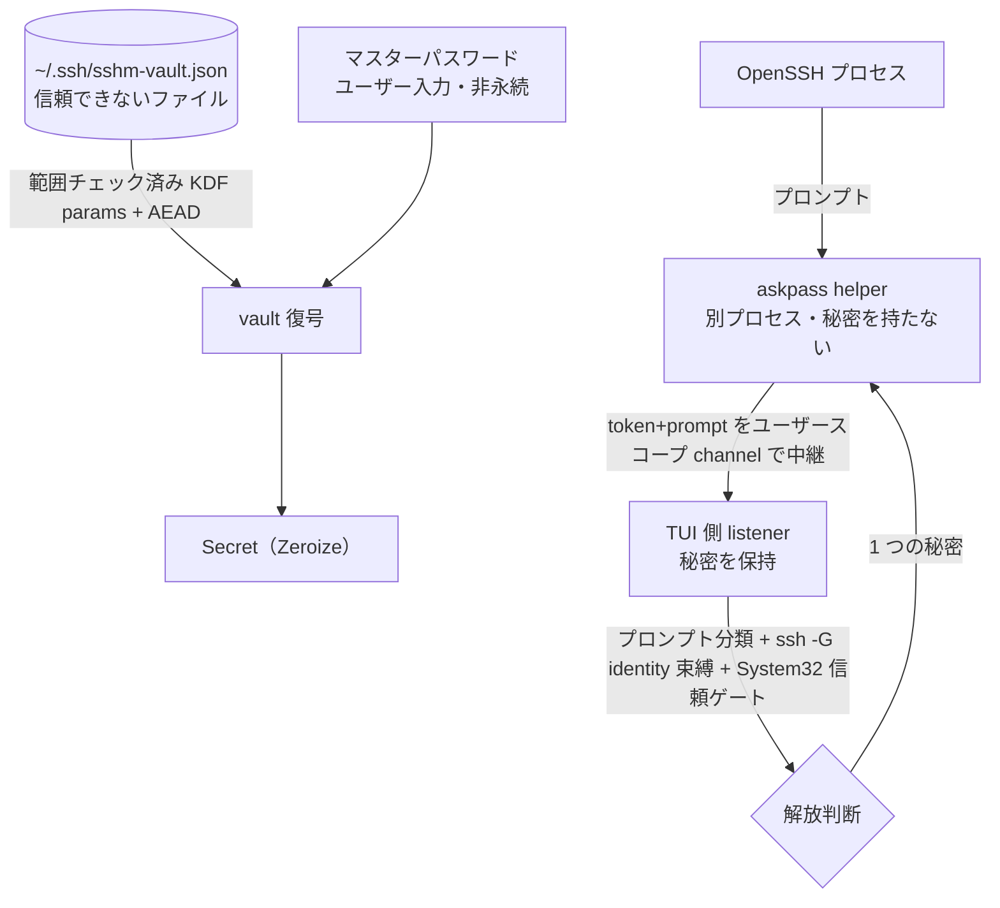

# security 領域 設計（vault・askpass・信頼境界）

> status: draft — 初期骨子。本プロジェクトの中核。`security-reviewer`／`windows-first-reviewer` が実装との整合をこの記述と照合する。

## 責務

秘密（ログインパスワード・鍵パスフレーズ）を SSH config から隔離し、暗号化して保存・接続時に安全に解放する。関連実装は `os/vault.rs`・`os/askpass.rs`・`secure_fs.rs`。

## 信頼境界（外部入力がどこを通るか）

## 秘密の解放判断（認可の代替＝単一ユーザーのため役割表ではなく解放条件表）

**共通ゲート（password・passphrase の両方に必須。1 つでも不成立なら解放しない）:**

| 条件 | 要求 |
|------|------|
| OpenSSH クライアントが `System32\OpenSSH` 由来か | `is_system32`（`GetSystemDirectoryW` で解決） |
| プロンプトの分類（password / passphrase） | `SecretKind` に一致 |
| 解決した identity（`ssh -G`）と vault エントリの束縛 | 一致 |
| vault がアンロック済みか | マスターパスワードで復号済み |

**種別ごとの consent（`decide()` の分岐。ここが password と passphrase で異なる）:**

| 秘密の種別 | consent 要求 | 実装 |
|-----------|------------|------|
| **ログインパスワード** | **2 層 consent（両方必須）**: ①永続 opt-in（`prefs.rs` の `password_autofill_enabled`）＋②per-target 同意（`update.rs` の `confirmed_password_targets` モーダル承認）。加えて override のユーザー変更ガード・OpenSSH<8.5 分離・`Match exec` degrade 等の password 固有ゲート | `prefs.rs` / `update.rs` / `askpass.rs` |
| **鍵パスフレーズ** | **consent 非依存＝ローカル限定で常時有効**（`askpass.rs`「passphrase auto-fill is local-only and stays enabled」）。opt-in を見ず、identity 一致と per-path single-shot のみ判定 | `askpass.rs` の `decide()` Passphrase 分岐 |

## ホスト鍵の事前ピン留め（keyscan・#46）と TOFU の正直さ

- **ピン留めが `is_known` ゲートを満たす正規経路**: `connect_plan` の「host key not yet trusted」blanket ゲート（autofill の前提条件）は**変更しない**。keyscan によるピン留めで known_hosts にエントリが入ることでゲートが自然に通る（ゲート緩和ではなくデータ側の充足）。ピン留め行のホストトークンは `tofu_lookup_key` の出力に正規化するため、ゲートが引く `ssh-keygen -F` の検索キーと必ず一致する。
- **帯域外検証ではないことを偽らない**: keyscan は接続と同じ経路でのスキャンであり、MITM 下では同じ偽鍵を掴む。モーダルは常に「信頼できる情報源（サーバコンソール・プロバイダのドキュメント等）とフィンガープリントを照合せよ」と提示し、randomart＋SHA256 を照合材料として出す。TOFU を「確認済み」にすり替えない。
- **スキャンは何も認証しない（この節の前提）**: `ssh-keyscan` は `verify_host_key` で KEX を中断するため、**応答者が秘密鍵を保有していることを一切検証しない**。しかもホスト鍵は公開情報なので、経路上の攻撃者は正規ホストをスキャンして得た鍵を**リプレイ**しつつ自分の鍵を併載できる。ゆえに**スキャン結果のどんな性質からも、正直なサーバと攻撃者を区別できない**（実証済み: 秘密鍵を持たない応答器で `ssh-keyscan` が正規の公開鍵を返す）。「ピン済み鍵種が現れたか」等の証拠ベースの判定は、すべてこの事実により無効。
- **既に信頼判断のあるホストには何も追記しない（構造的規則）**: 承認キー（`y`）が追記できるのは、**`ssh-keygen -F` がこの host に対して 1 行も返さないとき**だけ（`PinBlocked::AlreadyPinned`）。`matching_known_entries` が返す行はすべて OpenSSH がこのホストに対して**有効に扱う**行なので、素のピン・`@cert-authority`（CA 委任）・`@revoked`（明示された不信）・ホストを覆うワイルドカード、いずれの隣に未認証の鍵を足しても、利用者が決めた範囲を超えて信頼が広がる。
  - **例外を作るたびに破られた**（#46 rounds 5–8）。「marker 無しだけ」→「非パターンだけ」と狭めるたびに、除外した形が迂回路になった。最後に残っていた「marker 無しワイルドカード」も、`*.example ssh-ed25519 <genuine>` がある状態で実 OpenSSH が別鍵種に HOST KEY CHANGED を出すこと、そして追記後は無警告で受理することを実証されて崩れた。**除外は作らない**のが結論。
  - ワイルドカードが覆うホストに厳密なピンを作りたい場合は、Known hosts 画面での明示操作に委ねる（何も認証しないスキャンの仕事ではない）。
- **`ssh-keygen -F` が見られない信頼経路があるならスキャンしない**: `KnownHostsCommand`（OpenSSH 8.5+・プログラムが known_hosts 行を供給する）・`VerifyHostKeyDNS`（DNSSEC 署名付き SSHFP が known_hosts 無しでホストを認証する）・`GSSAPIKeyExchange`（Kerberos がサーバを認証しホスト鍵を検証しない）は、いずれもファイルを読むだけでは見えない。ここで「一致行が無い＝未ピン」と解釈すると、確立済みの信頼経路の隣に鍵を足すことになる（`KnownHostsCommand` で実証済み）。`has_external_trust_source` を立ててスキャン自体を拒否する。
  - **値は `ssh -G` が実際に出す形で判定する**: multistate オプションは config の `yes`/`no` ではなく **`true`/`false`/`ask`** で出力される。`yes` だけを見ていた実装は死にコードで、しかも「`ssh -G` が出せない文字列」を渡す単体テストが通っていたため気づけなかった（#46 round 9）。**この種のテストは実 `ssh -G` の出力形に合わせる**。
  - `VerifyHostKeyDNS ask` は対象外（利用者の確認を経て known_hosts に記録されるので「一致行が無い＝未信頼」が成り立つ）。
- **`Match exec` は「予測」せず「検証」する**: `ssh -G` は述語を**実行する**が、それはこのホストへ `ssh` する時と同じことであり、スキャンは利用者の明示操作なので受け入れる。**config テキストを読んで述語の有無を当てにいくのはやめた**（#46 rounds 9–11）。
  - 3 巡にわたり、読み込み済みファイルのみ → `~/.ssh/config` と `/etc/ssh/ssh_config` も → `Include` 展開も、と広げるたびに破られた。原因は明確で、**OpenSSH のパーサと `glob(3)` を再実装して挙動を予測していた**こと: `Match !exec`・非 UTF-8 バイト 1 つ・`Include` の `[...]` クラス・引用や `=` を含む include パス・Windows のシステム config 位置が、それぞれ素通りした。加えて config 読み取り自体が DoS 面を作った（fifo を include すると UI スレッドが永久にブロックする）。
  - 代わりに「**このスキャンが立脚した解決が動いていないか**」を検証する。`handle_keyscan` は追記直前に再解決し、**開始時の全ゲート（`keyscan_preconditions`）を丸ごと再評価**したうえで、known_hosts のファイル一覧・書き込み先・lookup key のいずれかが変わっていれば拒否する。少数のフィールドだけ比べていた版では、モーダル表示中に `KnownHostsCommand`・プロキシ・分割不能パスを獲得した config がそのまま追記できた（#46 round 12）。
  - **残る限界（重要・利用者に伝わるべき）**: これは**隣接する 2 サンプルの比較**であって、解決の揺れを一般に検出するものではない。限界の正しい言い方は「`Match exec` を検出できない」ではなく「**スキャン時と後の接続時とで解決が変わりうる設定は、どんな形であれ検出できない**」。実例として、社内 VPN 上かどうかで `UserKnownHostsFile` を切り替える設定では、スキャン時に見えなかったファイルのピンが接続時には読まれ、そこに並べた鍵が無警告で受理されうる。
    - **予測方式（config 解析）ならこの穴を塞げた、というのは誤り**（#46 round 13 の指摘）。`Match localnetwork`（OpenSSH 9.9+）は `exec` を一切使わずネットワーク次第で解決を変えるので、config テキストから `exec` を探す方式でも同じく素通りする。予測方式は「破られたから採らない」以前に、**この限界を塞げてもいなかった**。
    - **トレードオフとして受け入れた既知の残存リスク**であり、解決が変わりうる設定では手動ピン留めを推奨する（`CHANGELOG.md` の当該項目にも利用者向けに記載する）。
- **known_hosts のファイル一覧はオプションごとに解決する**: パス復元は隣接語の存在で連結するため、user と global を連結した一覧に対して行うと、`"<user の最後のファイル> <global の最初のファイル>"` という名前のファイル 1 つで global のピンを隠せる（利用者自身の `.ssh` への書き込み権限だけで成立する）。オプション単位で解決すればこの形は消える。加えて `Changed`／`Revoked` があれば同様に禁止（`PinBlocked::Contradicted`）。
  - 理由: OpenSSH は known_hosts の**いずれかの**行に一致した鍵を受理する。既存ピンの隣に未認証の鍵を 1 本足すだけで、そのピンは警告なしに無力化される（攻撃者は追記させた鍵種を選べばよい）。OpenSSH 自身も他鍵種が既知のときに自動追加はせず警告を出す。
  - **鍵の追加が正当な場合（鍵ローテーション等）は、Known hosts（`H`）で既存ピンを明示的に削除してから再スキャンする**。スキャンで判断できない以上、人間の明示操作を要求するのが正しい。
  - ピンが無いホストへのスキャンは**素の TOFU**であり、それ以上の保証は主張しない。安全装置は「信頼できる情報源と照合せよ」の常時表示（AC8）だけである。
  - **判定は追記直前に引き直した `matching_known_entries` に基づく**: モーダルを開いた時点のスナップショットで判断すると、開いている間に現れたピンの隣に追記できてしまう（OpenSSH は**署名検証の前に** known_hosts へ書くため、別端末での TOFU 承諾がこの窓に入る）。`y` は追記の直前に再読し、**各鍵を再分類してから** `pin_block` をやり直す（分類を古いままにすると、窓の間に `@revoked` された鍵をそのまま追記してしまう）。再読と追記の間には数マイクロ秒の窓が残る — 完全に閉じるにはファイルロックが要るため、ここは縮小に留める。
  - UI はこの状態で「ピン留めは無効」と理由付きで明示する。トリム順は「AC8 の検証文言が最後まで残る」（承認済み AC）ため、極端に低い端末では DISABLED 見出しが先に消える — ただしその状態でも `y` は何も追記しない。
- **`@revoked` を「信頼済み」と表示しない**: 分類は marker を見る（`@revoked` 一致＝`Revoked`／`@cert-authority` は host-key ピンではないので分類に参加しない）。取り消した鍵が `[already trusted]` と出るのは、この機能が正直であるべき唯一の局面での最悪の誤った安心になる。
- **ピン留め先は解決済み known_hosts ファイル＋書き込み後の実効性検証**: 追記先は `ssh -G` が報告した `UserKnownHostsFile` の先頭（`keyscan_pin_target`→`primary_known_hosts_file`）。`~/.ssh/known_hosts` 決め打ちは、カスタムファイル構成で「成功表示のまま ssh が読まない場所へ書く」無効動作になり、かつ意図的に隔離されたホストの信頼を既定ファイル利用の全エイリアスへ広げてしまう。
  - **パスの復元が要る**: `ssh -G` はファイル一覧を**引用なしの空白区切り**で出すため、空白を含むパス（Windows の既定 `%USERPROFILE%\.ssh\known_hosts` は、ユーザー名に空白があれば `C:\Users\First Last\.ssh\known_hosts` になる）は分割されて届く。素朴に `first()` を取ると `C:\Users\First` という別ファイルを作ってしまうので、`coalesce_existing_paths` で**親ディレクトリの存在**を手がかりに復元する（初回ピンではファイル自体はまだ無い）。`__PROGRAMDATA__` の展開も同経路で行う。
  - **`UserKnownHostsFile none` を拒否する**: OpenSSH は `none` を「ファイルを読まない」の標識として扱い、`ssh -G` もそのまま出す。これをファイル名と解釈すると CWD にゴミを作って成功と表示し、しかも `is_host_known` が true になってオートフィルまで武装してしまう。**判定は「オプションごとのリスト全体」に対して行う**（`is_none_file_list`）。ここは 2 度間違えた場所なので明記する:
    - **要素単位で落とすのは誤り**: 長いリストの中の `none` は標識ではなく `…/my none dir/…` のようなパス成分で、落とすとパスが分断されて真正ピンを見落とす。
    - **連結後のリストで判定するのも誤り**: OpenSSH の「単独でのみ指定可」は**オプションごと**の規則なので、user と global を連結すると標識が長いリストの 1 要素になって見逃す。`known_hosts_files` が連結の**前に**各リストを落とす。
  - **解決できないファイルがあればピン留めしない**: 明示設定された `GlobalKnownHostsFile` の `~`/`%` は `ssh -G` が未展開で出す（`resolve.rs` の既知ギャップ）。読み取り側では「未知扱い」で安全側に倒れるが、書き込み側では**真正ピンを見落として隣に追記する** fail-open になる。`has_unresolvable_known_hosts_file` が真ならスキャンを拒否する（不完全な材料で可否を判断しない）。
  - **区切りを復元できない一覧ではスキャンしない**: `ssh -G` はファイル一覧を**引用なしで 1 スペース区切り**で出すが、**パス中の空白は潰さない**（OpenSSH 9.6p1 で確認。以前ここに「`ssh -G` が空白を潰す」と書いていたのは誤りで、潰していたのは当方の `split_quoted_paths`）。したがって空白ラン・タブは**パスの中身**であり、空白で分割する実装では境界を復元できない。この状態では「見えているピン」も「書き込み先」も信用できない — 実際、区切り不明のまま書くと ssh が読む本物のファイルへ攻撃者鍵を追記して成功と表示する経路が成立した。`parse_ssh_g_output` が `known_hosts_list_lossy` を立て、`open_keyscan` がスキャン自体を拒否する。
    - **判定は分割器自身に訊く**（`split_quoted_paths(raw).join(" ") == raw` か）。手書きの走査器は分割器の**2 つ目のモデル**になり、実際に食い違った: 引用区間を除外していたが `split_quoted_paths` は行頭の引用しか特別扱いしないため、リテラルの `"` 以降のランを見逃していた。
    - **判定は生の値に対して行う**（trim しない）。**先頭・末尾のラン**も中身のランと同様に復元不能で、trim してから調べると当のバイトが消える。
  - **曖昧な一覧ではスキャンしない**: `"<fileA> <fileB>"` という名前のファイルが実在すると、報告された語の並びは「別々のパス」とも「1 つの空白入りパス」とも読める。coalesce は貪欲に長い方を採るため、`fileB` 以降のピンが見えなくなる一方で書き込み先は ssh が実際に読むファイルのまま、という組み合わせが成立した（#46 round 11・実証済み）。読み取り側は貪欲な推測でも「エントリを取りこぼす」だけだが、書き込み側は許されないので拒否する（`known_hosts_paths_are_ambiguous`）。判定の形は 1 度間違えているので明記する:
    - **問いは「この解釈が実在ファイルを取りこぼすか」**であって、個々の連結の性質ではない。実装は語列の**全連続部分列**を総当たりして通常ファイルを探し、それが**読み手・書き手それぞれの分割結果に現れなければ**曖昧とみなす（`coalesce_existing_paths` を両述語で回して突き合わせる）。
    - **連結単位のローカルな規則は 2 度間違えた**。この履歴が「直接問う」形に至った理由なので残す。
      - **先頭語の実在で見るのは誤り**（#46 round 12）: coalesce は**連結が実在するか**だけで連結するので、先頭語が実在しない並びは検査を素通りしつつ後続のピンを隠した。
      - **飲み込まれる側を「語」で見るのも誤り**（#46 round 13）: 真正の known_hosts パス自体が空白を含みうる（Windows でユーザー名に空白があるホーム＝`C:\Users\First Last\…`）ため `ssh -G` は複数語で報告する。「どれか 1 語が実在ファイルか」では**空白入りの真正ピンだけが検査に映らない**。
      - **連結の「内側」の部分列だけ見るのも誤り**（#46 round 14）: 攻撃者のファイルが真正パスを**内包せず跨ぐ**（語 1–2 と語 2–3）と、真正ファイルは連結範囲の外へはみ出して検査に映らないまま、貪欲な連結で読み取り集合から消える。実 OpenSSH で攻撃者鍵の受理まで実証された。
    - **読み手と書き手の両方の述語で見る**（#46 round 12・上記の突き合わせに内包）。読み取りは「連結が実在」、書き込みは「連結の親ディレクトリが実在」でも連結する（初回ピンはファイルがまだ無いため）。片方だけで検査すると、攻撃者は検査されない側を選べる。
    - **ディレクトリは数えない**（エントリを持たないため）。数えると、`C:\Users\Bob` と `C:\Users\Bob Smith` が併存する Windows で機能が死ぬ。
  - **復元が怪しい書き込み先も拒否する**: coalesce は一致しない実行を単語単位に退化させるため、先頭要素が切り詰められた接頭辞になりうる。`primary_known_hosts_file` は coalesce 後の**全要素**が書き込み可能に見えないかぎり `None` を返す。
  - **最後は OpenSSH に確認させる**: 追記後に、**いま書いた鍵（`key_type` + `key_b64`）が**OpenSSH のマッチャから見えるかを確認し、見えなければ成功と報告せず書いた場所を添えて警告する（「ピンが 1 つでも見えるか」では既存ピンが条件を満たしてしまう）。解決は追記の**後**に行う: 初回ピンではファイルがまだ存在せず、事前解決だと読み取り集合から落ちて偽の失敗になるため。迷子ファイルが集合に紛れ込む心配は、上記の「復元できないパスへは書かない」で断ってある。
- **ピン留めキーは単一リテラルトークンに限る**: `lookup_key` は追記行のホスト欄へそのまま入るため、ワイルドカード・否定・カンマ列・空白・`@` マーカーを含む値はピン留めを拒否する（`keyscan_lookup_key_gate`）。先頭の `-`（将来の呼び出し側が `--` を忘れたときにフラグと解釈されうる）と先頭の `|`（ハッシュ化エントリの接頭辞。手で組み立てた `|1|salt|hash` を OpenSSH が実際に honour することを確認済み）も拒否する。
- 削除は KnownHosts 画面の明示操作（`d`＋確認）に限定し、攻撃下での反射的な上書きを構造的に不可能にする。
- **スキャンは非武装のまま実行する**: keyscan は `ssh-keyscan` の単発起動で、askpass の arm（`SSH_ASKPASS_REQUIRE=force`）も vault の解錠も伴わない。ゆえに未信頼ホストへのスキャン自体が秘密を露出させることはない。

## 暗号設計（vault）

- マスターパスワード → **Argon2id** で 32 byte 鍵。エントリを **XChaCha20-Poly1305（AEAD）**で封緘。
- salt/nonce/KDF パラメータは平文だが **associated data** に束縛（改竄ヘッダはタグ検証で落ちる）。KDF パラメータは復号前に**範囲チェック**（DoS・弱体化を防ぐ）。
- マスターパスワードは永続化しない（誤りは AEAD タグ失敗）。秘密は `Zeroize`（drop 時スクラブ・`Debug` redact）。アイドル 15 分で自動ロック。

## 主要な設計判断（現行の理由）

- **秘密を config から完全分離**: OpenSSH config に秘密の置き場が無く、平文は危険。独立ファイル `~/.ssh/sshm-vault.json`。
- **listener/helper 分離**: 秘密を持つのは信頼された TUI 側 listener のみ。helper は中継のみ（秘密を持たない別プロセス）。
- **System32 信頼ゲート**: spoof 可能な PATH/CWD ではなく `GetSystemDirectoryW` で System32 を解決して門番（過去のインシデント修正の帰結）。
- **耐久・owner-private 書き込み**: `secure_fs`（O_EXCL 一時名・owner-only 権限・fsync・原子 rename）。
