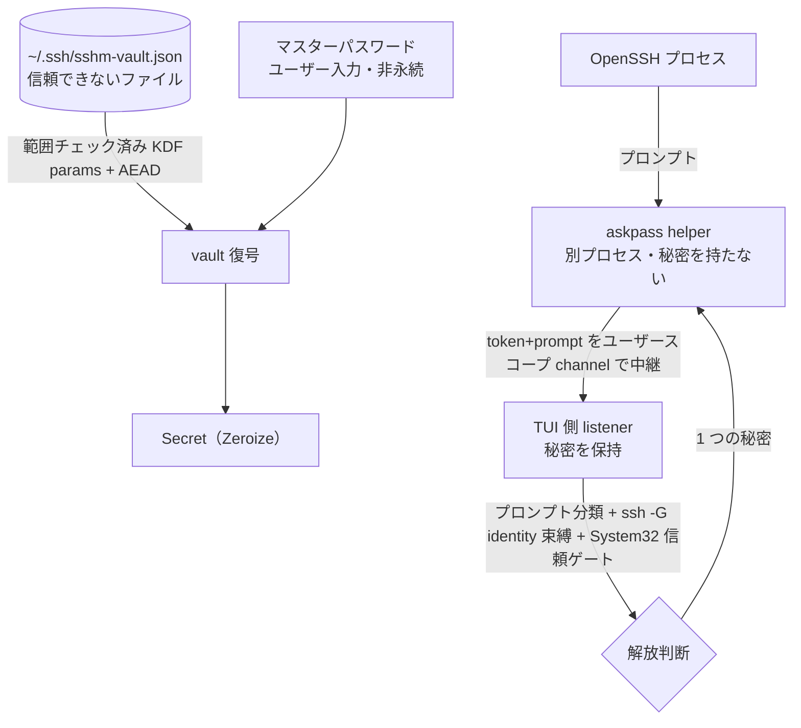

# security 領域 設計（vault・askpass・信頼境界）

> status: draft — 初期骨子。本プロジェクトの中核。`security-reviewer`／`windows-first-reviewer` が実装との整合をこの記述と照合する。

## 責務

秘密（ログインパスワード・鍵パスフレーズ）を SSH config から隔離し、暗号化して保存・接続時に安全に解放する。関連実装は `os/vault.rs`・`os/askpass.rs`・`secure_fs.rs`。

## 信頼境界（外部入力がどこを通るか）

## 秘密の解放判断（認可の代替＝単一ユーザーのため役割表ではなく解放条件表）

**共通ゲート（password・passphrase の両方に必須。1 つでも不成立なら解放しない）:**

| 条件 | 要求 |
|------|------|
| OpenSSH クライアントが `System32\OpenSSH` 由来か | `is_system32`（`GetSystemDirectoryW` で解決） |
| プロンプトの分類（password / passphrase） | `SecretKind` に一致 |
| 解決した identity（`ssh -G`）と vault エントリの束縛 | 一致 |
| vault がアンロック済みか | マスターパスワードで復号済み |

**種別ごとの consent（`decide()` の分岐。ここが password と passphrase で異なる）:**

| 秘密の種別 | consent 要求 | 実装 |
|-----------|------------|------|
| **ログインパスワード** | **2 層 consent（両方必須）**: ①永続 opt-in（`prefs.rs` の `password_autofill_enabled`）＋②per-target 同意（`update.rs` の `confirmed_password_targets` モーダル承認）。加えて override のユーザー変更ガード・OpenSSH<8.5 分離・`Match exec` degrade 等の password 固有ゲート | `prefs.rs` / `update.rs` / `askpass.rs` |
| **鍵パスフレーズ** | **consent 非依存＝ローカル限定で常時有効**（`askpass.rs`「passphrase auto-fill is local-only and stays enabled」）。opt-in を見ず、identity 一致と per-path single-shot のみ判定 | `askpass.rs` の `decide()` Passphrase 分岐 |

## 暗号設計（vault）

- マスターパスワード → **Argon2id** で 32 byte 鍵。エントリを **XChaCha20-Poly1305（AEAD）**で封緘。
- salt/nonce/KDF パラメータは平文だが **associated data** に束縛（改竄ヘッダはタグ検証で落ちる）。KDF パラメータは復号前に**範囲チェック**（DoS・弱体化を防ぐ）。
- マスターパスワードは永続化しない（誤りは AEAD タグ失敗）。秘密は `Zeroize`（drop 時スクラブ・`Debug` redact）。アイドル 15 分で自動ロック。

## パスフレーズ変更と vault の同期（#47）

`ssh-keygen -p` によるパスフレーズ追加・変更が成功すると、vault の該当 `Passphrase` エントリは陳腐化する（放置すると接続時オートフィルが旧パスフレーズを出して失敗する）。同期フロー（実装は `update.rs` の `offer_passphrase_sync`／`submit_passphrase_sync`）:

1. **検出**（`keys::stale_passphrase_hosts`・純粋）: 変更した鍵を使うホストを `HostView` 射影から逆引きし、vault の `Passphrase` エントリと突合する。`ssh -G` の全ホスト実行はしない（spawn 数過多・`Match exec` の再実行を避け、config 射影で決定的に逆引きする）。**照合規則は接続時オートフィルと一致させること**が要（ずれると「接続時には使われるのに陳腐化検出では拾えない」＝旧パスフレーズが放出され続ける穴になる。#47 のレビューで実際に検出された）:
   - **突合キーは `Host` 行の非 glob パターン全て**（先頭の alias だけではない）。`match_vault_kinds`（`vault.rs`）・`gather_secrets`（`update.rs`）と同じ走査。glob（`* ? !`）は vault エントリに一致しえないので候補にしない。
   - **パス比較は Windows で大小・区切りを畳む**（`keys::same_key_path`）。接続時の `askpass::paths_equal` と同じ扱いで、手書きの `c:\users\…` 表記でも一致する。
   - **IdentityFile 未宣言のホストは OpenSSH の既定 identity を暗黙候補にする**（`DEFAULT_IDENTITY_FILES`）。`Host x` ＋ `HostName` だけという最も一般的な構成を取りこぼさないため。
2. **ロック中は検出前にアンロックへ迂回**: ロック中はエントリを読めず陳腐化の有無すら判定できないため、`App::passphrase_sync_pending` に鍵パスを置いて `VaultUnlock` を開き、アンロック成功後に検出をやり直す。Esc（アンロック拒否）は再開マーカーを破棄して黙って終わる＝同期は強制しない。
3. **一括更新**: 一致があれば一括更新モーダル（`Screen::PassphraseSync`）で新パスフレーズを **1 回**入力する。対象の選定は `plan_passphrase_sync`（純粋）が行い、**`Passphrase` エントリだけ**を選ぶ（同一ホストの login `Password` を鍵パスフレーズで上書きしない）。書き込みは全件をメモリ上で差し替えてから **`save` を 1 回**だけ呼ぶ（`atomic_write` が原子的なので「一部のホストだけ新パスフレーズ」という中途半端な状態が原理的に起きない。保存失敗時はメモリ側も退避から巻き戻す）。入力は `PassphraseSyncForm`（Drop でスクラブ・`Debug` redact）に保持し、各エントリへは `Secret` のクローンとして渡す（平文 String を撒かない）。保存前に単体保存と同じ「配送できない秘密」検証（改行/CR・1023 バイト超）を通す。モーダル表示中にアイドル自動ロックが挟まった場合は**何も更新せず**警告して閉じる（`consent_should_be_recorded` と同じロック境界）。
4. **限界（受容済み）**: sshm は ssh-keygen の対話を捕捉しないため、モーダル入力値が ssh-keygen に渡した値と一致する保証はない（typo リスク）。誤入力時はオートフィル失敗として顕在化する＝従来（陳腐化放置）と同じ失敗モードであり悪化はしない。

## 主要な設計判断（現行の理由）

- **秘密を config から完全分離**: OpenSSH config に秘密の置き場が無く、平文は危険。独立ファイル `~/.ssh/sshm-vault.json`。
- **listener/helper 分離**: 秘密を持つのは信頼された TUI 側 listener のみ。helper は中継のみ（秘密を持たない別プロセス）。
- **System32 信頼ゲート**: spoof 可能な PATH/CWD ではなく `GetSystemDirectoryW` で System32 を解決して門番（過去のインシデント修正の帰結）。
- **耐久・owner-private 書き込み**: `secure_fs`（O_EXCL 一時名・owner-only 権限・fsync・原子 rename）。
- **陳腐化 vault エントリは一括更新フローで同期**（#47）: 「vault 画面へ誘導のみ」「警告トーストのみ」と比較し、1 回の入力で該当全ホストのオートフィルが即時復旧する UX と、Issue の「更新を促すフローまで含めるのが本体」への適合で一括更新案を採択（上記「パスフレーズ変更と vault の同期」節）。
