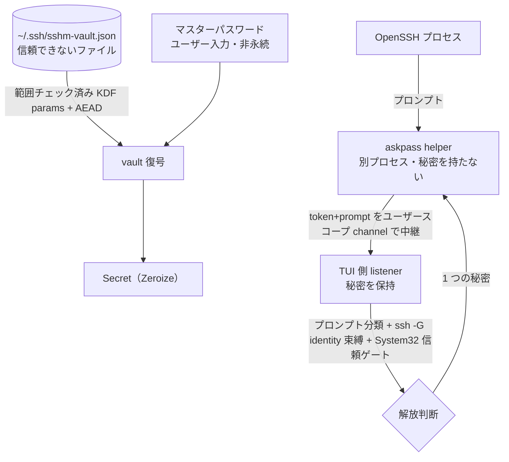

# security 領域 設計（vault・askpass・信頼境界）

> status: draft — 初期骨子。本プロジェクトの中核。`security-reviewer`／`windows-first-reviewer` が実装との整合をこの記述と照合する。

## 責務

秘密（ログインパスワード・鍵パスフレーズ）を SSH config から隔離し、暗号化して保存・接続時に安全に解放する。関連実装は `os/vault.rs`・`os/askpass.rs`・`secure_fs.rs`。

## 信頼境界（外部入力がどこを通るか）

## 秘密の解放判断（認可の代替＝単一ユーザーのため役割表ではなく解放条件表）

| 条件 | 要求 | 不成立時 |
|------|------|---------|
| OpenSSH クライアントが `System32\OpenSSH` 由来か | `is_system32`（`GetSystemDirectoryW` で解決） | 解放しない |
| プロンプトの分類（パスワード / パスフレーズ） | `SecretKind` に一致 | 解放しない |
| 解決した identity（`ssh -G`）と vault エントリの束縛 | 一致 | 解放しない |
| セッションのユーザー同意（オートフィル opt-in） | `prefs` の consent | 解放しない |

## 暗号設計（vault）

- マスターパスワード → **Argon2id** で 32 byte 鍵。エントリを **XChaCha20-Poly1305（AEAD）**で封緘。
- salt/nonce/KDF パラメータは平文だが **associated data** に束縛（改竄ヘッダはタグ検証で落ちる）。KDF パラメータは復号前に**範囲チェック**（DoS・弱体化を防ぐ）。
- マスターパスワードは永続化しない（誤りは AEAD タグ失敗）。秘密は `Zeroize`（drop 時スクラブ・`Debug` redact）。アイドル 15 分で自動ロック。

## 主要な設計判断（現行の理由）

- **秘密を config から完全分離**: OpenSSH config に秘密の置き場が無く、平文は危険。独立ファイル `~/.ssh/sshm-vault.json`。
- **listener/helper 分離**: 秘密を持つのは信頼された TUI 側 listener のみ。helper は中継のみ（秘密を持たない別プロセス）。
- **System32 信頼ゲート**: spoof 可能な PATH/CWD ではなく `GetSystemDirectoryW` で System32 を解決して門番（過去のインシデント修正の帰結）。
- **耐久・owner-private 書き込み**: `secure_fs`（O_EXCL 一時名・owner-only 権限・fsync・原子 rename）。
