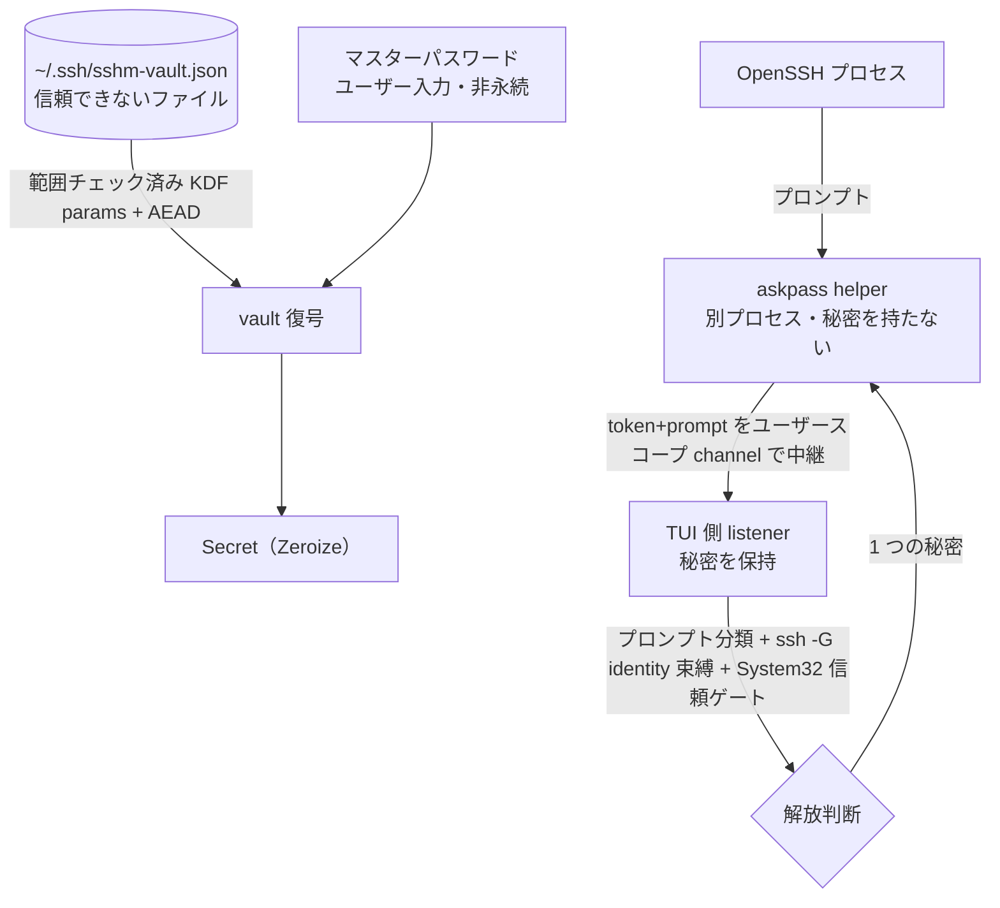

# security 領域 設計（vault・askpass・信頼境界）

> status: draft — 初期骨子。本プロジェクトの中核。`security-reviewer`／`windows-first-reviewer` が実装との整合をこの記述と照合する。

## 責務

秘密（ログインパスワード・鍵パスフレーズ）を SSH config から隔離し、暗号化して保存・接続時に安全に解放する。関連実装は `os/vault.rs`・`os/askpass.rs`・`secure_fs.rs`。

## 信頼境界（外部入力がどこを通るか）

## 秘密の解放判断（認可の代替＝単一ユーザーのため役割表ではなく解放条件表）

**共通ゲート（password・passphrase の両方に必須。1 つでも不成立なら解放しない）:**

| 条件 | 要求 |
|------|------|
| OpenSSH クライアントが `System32\OpenSSH` 由来か | `is_system32`（`GetSystemDirectoryW` で解決） |
| プロンプトの分類（password / passphrase） | `SecretKind` に一致 |
| 解決した identity（`ssh -G`）と vault エントリの束縛 | 一致 |
| vault がアンロック済みか | マスターパスワードで復号済み |

**種別ごとの consent（`decide()` の分岐。ここが password と passphrase で異なる）:**

| 秘密の種別 | consent 要求 | 実装 |
|-----------|------------|------|
| **ログインパスワード** | **2 層 consent（両方必須）**: ①永続 opt-in（`prefs.rs` の `password_autofill_enabled`）＋②per-target 同意（`update.rs` の `confirmed_password_targets` モーダル承認）。加えて override のユーザー変更ガード・OpenSSH<8.5 分離・`Match exec` degrade 等の password 固有ゲート | `prefs.rs` / `update.rs` / `askpass.rs` |
| **鍵パスフレーズ** | **consent 非依存＝ローカル限定で常時有効**（`askpass.rs`「passphrase auto-fill is local-only and stays enabled」）。opt-in を見ず、identity 一致と per-path single-shot のみ判定 | `askpass.rs` の `decide()` Passphrase 分岐 |

## ホスト鍵の事前ピン留め（keyscan・#46）と TOFU の正直さ

- **ピン留めが `is_known` ゲートを満たす正規経路**: `connect_plan` の「host key not yet trusted」blanket ゲート（autofill の前提条件）は**変更しない**。keyscan によるピン留めで known_hosts にエントリが入ることでゲートが自然に通る（ゲート緩和ではなくデータ側の充足）。ピン留め行のホストトークンは `tofu_lookup_key` の出力に正規化するため、ゲートが引く `ssh-keygen -F` の検索キーと必ず一致する。
- **帯域外検証ではないことを偽らない**: keyscan は接続と同じ経路でのスキャンであり、MITM 下では同じ偽鍵を掴む。モーダルは常に「信頼できる情報源（サーバコンソール・プロバイダのドキュメント等）とフィンガープリントを照合せよ」と提示し、randomart＋SHA256 を照合材料として出す。TOFU を「確認済み」にすり替えない。
- **スキャンは何も認証しない（この節の前提）**: `ssh-keyscan` は `verify_host_key` で KEX を中断するため、**応答者が秘密鍵を保有していることを一切検証しない**。しかもホスト鍵は公開情報なので、経路上の攻撃者は正規ホストをスキャンして得た鍵を**リプレイ**しつつ自分の鍵を併載できる。ゆえに**スキャン結果のどんな性質からも、正直なサーバと攻撃者を区別できない**（実証済み: 秘密鍵を持たない応答器で `ssh-keyscan` が正規の公開鍵を返す）。「ピン済み鍵種が現れたか」等の証拠ベースの判定は、すべてこの事実により無効。
- **既に信頼判断のあるホストには何も追記しない（構造的規則）**: 承認キー（`y`）が追記できるのは、**この host について既存の信頼判断が 1 つも無いとき**だけ（`PinBlocked::AlreadyPinned`）。既存の信頼判断とは、**marker 付きのエントリすべて**と、**marker 無しの非パターンエントリ**（＝素のピン）。marker には `@cert-authority`（CA 委任＝有効な信頼経路。隣に生鍵を置くと CA の失効管理を迂回できる）と `@revoked`（管理者が明示した不信）があり、**ホスト欄がワイルドカードでも数える** — `@cert-authority *.example.com` が実際に書かれる形であり、OpenSSH はそのホストに対して有効に扱うため。marker 無しのワイルドカードだけは**含めない**（信頼ゲートが無視するため、含めると利用者が厳密なピンを作れなくなる）。加えて `Changed`／`Revoked` があれば同様に禁止（`PinBlocked::Contradicted`）。
  - 理由: OpenSSH は known_hosts の**いずれかの**行に一致した鍵を受理する。既存ピンの隣に未認証の鍵を 1 本足すだけで、そのピンは警告なしに無力化される（攻撃者は追記させた鍵種を選べばよい）。OpenSSH 自身も他鍵種が既知のときに自動追加はせず警告を出す。
  - **鍵の追加が正当な場合（鍵ローテーション等）は、Known hosts（`H`）で既存ピンを明示的に削除してから再スキャンする**。スキャンで判断できない以上、人間の明示操作を要求するのが正しい。
  - ピンが無いホストへのスキャンは**素の TOFU**であり、それ以上の保証は主張しない。安全装置は「信頼できる情報源と照合せよ」の常時表示（AC8）だけである。
  - **判定は追記直前に引き直した `matching_known_entries` に基づく**: モーダルを開いた時点のスナップショットで判断すると、開いている間に現れたピンの隣に追記できてしまう（OpenSSH は**署名検証の前に** known_hosts へ書くため、別端末での TOFU 承諾がこの窓に入る）。`y` は追記の直前に再読し、**各鍵を再分類してから** `pin_block` をやり直す（分類を古いままにすると、窓の間に `@revoked` された鍵をそのまま追記してしまう）。再読と追記の間には数マイクロ秒の窓が残る — 完全に閉じるにはファイルロックが要るため、ここは縮小に留める。
  - UI はこの状態で「ピン留めは無効」と理由付きで明示する。トリム順は「AC8 の検証文言が最後まで残る」（承認済み AC）ため、極端に低い端末では DISABLED 見出しが先に消える — ただしその状態でも `y` は何も追記しない。
- **`@revoked` を「信頼済み」と表示しない**: 分類は marker を見る（`@revoked` 一致＝`Revoked`／`@cert-authority` は host-key ピンではないので分類に参加しない）。取り消した鍵が `[already trusted]` と出るのは、この機能が正直であるべき唯一の局面での最悪の誤った安心になる。
- **ピン留め先は解決済み known_hosts ファイル＋書き込み後の実効性検証**: 追記先は `ssh -G` が報告した `UserKnownHostsFile` の先頭（`keyscan_pin_target`→`primary_known_hosts_file`）。`~/.ssh/known_hosts` 決め打ちは、カスタムファイル構成で「成功表示のまま ssh が読まない場所へ書く」無効動作になり、かつ意図的に隔離されたホストの信頼を既定ファイル利用の全エイリアスへ広げてしまう。
  - **パスの復元が要る**: `ssh -G` はファイル一覧を**引用なしの空白区切り**で出すため、空白を含むパス（`C:\Users\First Last\.ssh\known_hosts` ＝ Windows の既定）は分割されて届く。素朴に `first()` を取ると `C:\Users\First` という別ファイルを作ってしまうので、`coalesce_existing_paths` で**親ディレクトリの存在**を手がかりに復元する（初回ピンではファイル自体はまだ無い）。`__PROGRAMDATA__` の展開も同経路で行う。
  - **`UserKnownHostsFile none` を拒否する**: OpenSSH は `none` を「ファイルを読まない」の標識として扱い、`ssh -G` もそのまま出す。これをファイル名と解釈すると CWD にゴミを作って成功と表示し、しかも `is_host_known` が true になってオートフィルまで武装してしまう。**判定は「オプションごとのリスト全体」に対して行う**（`is_none_file_list`）。ここは 2 度間違えた場所なので明記する:
    - **要素単位で落とすのは誤り**: 長いリストの中の `none` は標識ではなく `…/my none dir/…` のようなパス成分で、落とすとパスが分断されて真正ピンを見落とす。
    - **連結後のリストで判定するのも誤り**: OpenSSH の「単独でのみ指定可」は**オプションごと**の規則なので、user と global を連結すると標識が長いリストの 1 要素になって見逃す。`known_hosts_files` が連結の**前に**各リストを落とす。
  - **解決できないファイルがあればピン留めしない**: 明示設定された `GlobalKnownHostsFile` の `~`/`%` は `ssh -G` が未展開で出す（`resolve.rs` の既知ギャップ）。読み取り側では「未知扱い」で安全側に倒れるが、書き込み側では**真正ピンを見落として隣に追記する** fail-open になる。`has_unresolvable_known_hosts_file` が真ならスキャンを拒否する（不完全な材料で可否を判断しない）。
  - **区切りを復元できない一覧ではスキャンしない**: `ssh -G` はファイル一覧を**引用なしで 1 スペース区切り**で出すが、**パス中の空白は潰さない**（OpenSSH 9.6p1 で確認。以前ここに「`ssh -G` が空白を潰す」と書いていたのは誤りで、潰していたのは当方の `split_quoted_paths`）。したがって空白ラン・タブは**パスの中身**であり、空白で分割する実装では境界を復元できない。この状態では「見えているピン」も「書き込み先」も信用できない — 実際、区切り不明のまま書くと ssh が読む本物のファイルへ攻撃者鍵を追記して成功と表示する経路が成立した。`parse_ssh_g_output` が `known_hosts_list_lossy` を立て、`open_keyscan` がスキャン自体を拒否する。
    - **判定は分割器自身に訊く**（`split_quoted_paths(raw).join(" ") == raw` か）。手書きの走査器は分割器の**2 つ目のモデル**になり、実際に食い違った: 引用区間を除外していたが `split_quoted_paths` は行頭の引用しか特別扱いしないため、リテラルの `"` 以降のランを見逃していた。
    - **判定は生の値に対して行う**（trim しない）。**先頭・末尾のラン**も中身のランと同様に復元不能で、trim してから調べると当のバイトが消える。
  - **復元が怪しい書き込み先も拒否する**: coalesce は一致しない実行を単語単位に退化させるため、先頭要素が切り詰められた接頭辞になりうる。`primary_known_hosts_file` は coalesce 後の**全要素**が書き込み可能に見えないかぎり `None` を返す。
  - **最後は OpenSSH に確認させる**: 追記後に、**いま書いた鍵（`key_type` + `key_b64`）が**OpenSSH のマッチャから見えるかを確認し、見えなければ成功と報告せず書いた場所を添えて警告する（「ピンが 1 つでも見えるか」では既存ピンが条件を満たしてしまう）。解決は追記の**後**に行う: 初回ピンではファイルがまだ存在せず、事前解決だと読み取り集合から落ちて偽の失敗になるため。迷子ファイルが集合に紛れ込む心配は、上記の「復元できないパスへは書かない」で断ってある。
- **ピン留めキーは単一リテラルトークンに限る**: `lookup_key` は追記行のホスト欄へそのまま入るため、ワイルドカード・否定・カンマ列・空白・`@` マーカーを含む値はピン留めを拒否する（`keyscan_lookup_key_gate`）。
- 削除は KnownHosts 画面の明示操作（`d`＋確認）に限定し、攻撃下での反射的な上書きを構造的に不可能にする。
- **スキャンは非武装のまま実行する**: keyscan は `ssh-keyscan` の単発起動で、askpass の arm（`SSH_ASKPASS_REQUIRE=force`）も vault の解錠も伴わない。ゆえに未信頼ホストへのスキャン自体が秘密を露出させることはない。

## 暗号設計（vault）

- マスターパスワード → **Argon2id** で 32 byte 鍵。エントリを **XChaCha20-Poly1305（AEAD）**で封緘。
- salt/nonce/KDF パラメータは平文だが **associated data** に束縛（改竄ヘッダはタグ検証で落ちる）。KDF パラメータは復号前に**範囲チェック**（DoS・弱体化を防ぐ）。
- マスターパスワードは永続化しない（誤りは AEAD タグ失敗）。秘密は `Zeroize`（drop 時スクラブ・`Debug` redact）。アイドル 15 分で自動ロック。

## 主要な設計判断（現行の理由）

- **秘密を config から完全分離**: OpenSSH config に秘密の置き場が無く、平文は危険。独立ファイル `~/.ssh/sshm-vault.json`。
- **listener/helper 分離**: 秘密を持つのは信頼された TUI 側 listener のみ。helper は中継のみ（秘密を持たない別プロセス）。
- **System32 信頼ゲート**: spoof 可能な PATH/CWD ではなく `GetSystemDirectoryW` で System32 を解決して門番（過去のインシデント修正の帰結）。
- **耐久・owner-private 書き込み**: `secure_fs`（O_EXCL 一時名・owner-only 権限・fsync・原子 rename）。
