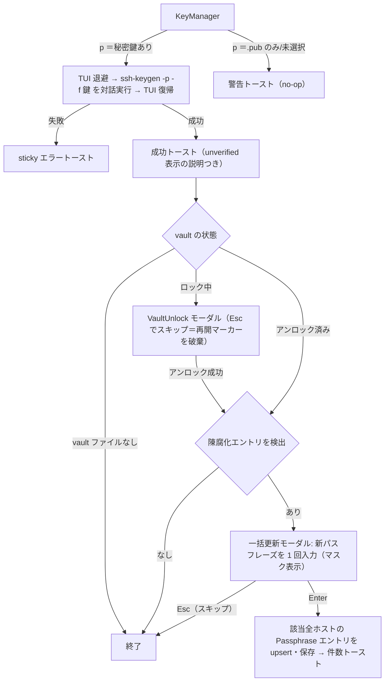

# ui 領域 設計（`src/ui/` — TUI 描画）

> status: draft — 初期骨子。**TUI（ratatui）であり Web フロントではない**（`frontendDir: none`）。ブラウザ向けの a11y/レスポンシブ検証（`frontend-reviewer`）は対象外で、UI 配慮は本領域の記述で担保する。

## 責務

`App.screen` でディスパッチし、ベース画面 → モーダルオーバーレイの順に描く**純粋描画**。ドメイン状態を mutate しない（widget のスクロール/選択状態だけ）。

## 構成要素

| モジュール | 役割 |
|-----------|------|
| `mod.rs` | `draw()` ディスパッチ。固定 3 行フレーム（breadcrumb・body・footer hints）＋モーダル重ね |
| `theme.rs` | 全色の単一真実源（Tokyo Night）・`selection()`/`border()`/`SELECT_SYMBOL`。色ハードコード禁止 |
| `widgets.rs` | `panel`/`modal_block`/`footer_hints`/`kv_line`/`section_header`/`input_line`/`responsive_split` |
| 画面別 | `list`・`edit`・`diff`・`vault`・`sftp`・`keys`・`known_hosts`・`confirm`・`connect_override`・`help` |

## UI/画面設計（TUI）

- **画面遷移**: `Screen` enum が駆動。モーダルは `App::prev_screen` + `open_overlay`/`close_overlay`。画面/モード追加時は `Screen`（app.rs）・dispatch（update.rs）・draw（ui/mod.rs）の 3 箇所を触る。
- **主要画面**: ホスト一覧（検索・到達性列・詳細ペイン）／編集フォーム／保存前 diff ／vault ／SFTP ブラウザ（2 ペイン）／鍵マネージャ／known_hosts ／ヘルプ。キーバインドの一覧は [README](../../README.md#keybindings) が真実源。
- **状態設計**: 空（0 件）・ローディング（到達性 `checking`）・エラー（`Toast`）・成功（自動失効 Toast）を各画面で扱う。
- **レスポンシブ**: `responsive_split` が `WIDE_MIN_WIDTH`（90 桁）以上で横並び・未満で縦積み。フッターは 80 桁以内で描ける（`footers_fit_80_cols` テスト）。
- **配色/コントラスト**: `theme.rs` の Tokyo Night パレットに集約。

### 鍵パスフレーズの追加・変更（#47）

鍵マネージャの `p`（passphrase 追加/変更）は、TUI を退避して `ssh-keygen -p` を対話実行し（現在/新パスフレーズは OpenSSH 自身が聴取）、成功後に vault の陳腐化 Passphrase エントリの一括更新モーダル（`Screen::PassphraseSync`）へ繋ぐ。**vault がロック中はエントリを読めない＝陳腐化の有無すら判定できない**ため、検出を試みる前にアンロックへ迂回し、アンロック成功後に判定をやり直す（`App::passphrase_sync_pending` が再開マーカー）:



生成ウィザードは 4 つ目のフィールドとして「Passphrase」トグル（Type と同じラジオ表現）を持つ:

```
┌─ Generate key ─────────────────────────────┐
│ Type:       (•) ed25519    ( ) rsa-4096    │
│ Filename:   id_ed25519                     │
│ Comment:    you@host                       │
│ Passphrase: (•) none       ( ) interactive │  ← #47 で追加
│  Tab/↑↓ move · Space toggle · Enter · Esc  │
└────────────────────────────────────────────┘
```

`interactive` を選ぶと `-N ""`/`-q` を発行せず TUI を退避して実行し、ssh-keygen 自身がパスフレーズを聴取する（sshm は値を持たない）。

保護直後の鍵は詳細ペインの PairStatus が Matched→Unverified に変わる（見かけの回帰）。手当ては二段: ①詳細ペインの Unverified 説明を「パスフレーズ無しでは検証できない（エラーではない）」に拡張（恒久）、②パスフレーズ変更の成功トーストにも同じ趣旨を含める（文脈）。

## 主要な設計判断（現行の理由）

- **描画と mutation の分離**: `ui/` は状態を変えず、全 mutation を `update.rs`/`app.rs` に集約（Elm 風）。テスト・見通しのため。
- **色の単一真実源**: 画面ごとの色ハードコードを禁止し `theme.rs` に集約（テーマ一貫性）。
- **ウィザードのパスフレーズはトグルフィールド案を採択**（#47）: 「生成実行時に毎回確認モーダルを挟む」案と比較し、フォームの一貫性（既存 3 フィールドと同じ巡回操作）とパスフレーズ不要ユーザーにステップを増やさない点で優位のため。
- **PairStatus の見かけ回帰は説明で吸収**（#47）: パスフレーズ無しで検証できないのは仕様（`derive_public_key` は `-P ""`）であり、状態を偽装せず説明文＋トーストで「エラーではない」ことを伝える。
