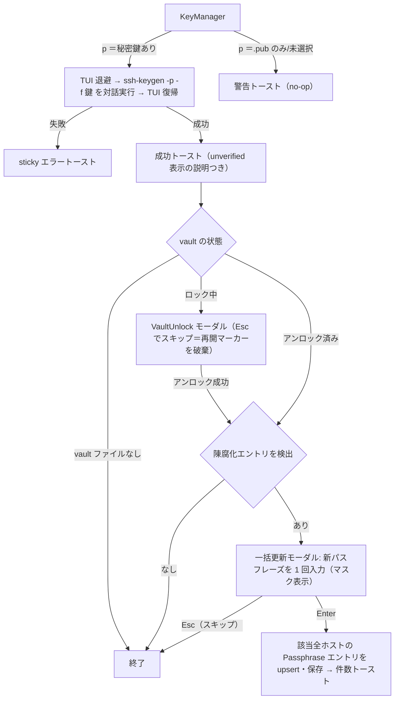

# ui 領域 設計（`src/ui/` — TUI 描画）

> **TUI（ratatui）であり Web フロントではない**（`frontendDir: none`）。ブラウザ向けの a11y/レスポンシブ検証（`frontend-reviewer`）は対象外で、UI 配慮は本領域の記述で担保する。

## 責務

`App.screen` でディスパッチし、ベース画面 → モーダルオーバーレイの順に描く**純粋描画**。ドメイン状態を mutate しない（widget のスクロール/選択状態だけ）。

## 構成要素

| モジュール | 役割 |
|-----------|------|
| `mod.rs` | `draw()` ディスパッチ。固定 3 行フレーム（breadcrumb・body・footer hints）＋モーダル重ね |
| `theme.rs` | 全色の単一真実源（Tokyo Night）・`selection()`/`border()`/`SELECT_SYMBOL`。色ハードコード禁止 |
| `widgets.rs` | `panel`/`modal_block`/`footer_hints`/`kv_line`/`section_header`/`input_line`/`responsive_split` |
| 画面別 | `list`・`edit`・`diff`・`vault`・`sftp`・`keys`・`known_hosts`・`inspect`・`confirm`・`connect_override`・`help` |

## UI/画面設計（TUI）

- **画面遷移**: `Screen` enum が駆動。モーダルは `App::prev_screen` + `open_overlay`/`close_overlay`。画面/モード追加時は `Screen`（app.rs）・dispatch（update.rs）・draw（ui/mod.rs）の 3 箇所を触る。
- **主要画面**: ホスト一覧（検索・到達性列・詳細ペイン）／編集フォーム／保存前 diff ／vault ／SFTP ブラウザ（2 ペイン）／鍵マネージャ／known_hosts ／**実効設定インスペクタ（`ssh -G` ビュー・#43）**／ヘルプ。キーバインドの一覧は [README](../../README.md#keybindings) が真実源。
- **実効設定インスペクタ（`Screen::Inspect`・#43）**: ホスト一覧で `i` を押すと、選択ホストの `ssh -G` 実効設定を**フルスクリーンのベース画面**（`known_hosts` と同じ流儀＝`app.screen = Screen::Inspect` を直接設定・Esc で List へ戻る。モーダルオーバーレイではない）で表示する。`resolve.rs::resolve_full` の順序付き key/value を `/` の部分一致フィルタ（`kh_filtered` と同じ大小無視の substring）と j/k・g/G スクロールで閲覧する（v1 は閲覧専用＝値コピー等は対象外）。
  - **開く前の安全ゲート（fail-safe・#65 で 3 経路統一・#73 で 2 段化）**: `i` 押下時、まず**クライアント信頼ゲート**（#73・`autofill_client_trusted()`＝`binaries::tools().is_system32`。Windows で System32 OpenSSH を解決できず `[PATH ssh]` フォールバック中なら `ssh -G` を実行せず sticky トーストで退避する。unix は常に信頼＝no-op）を通し、次に共有ゲート **`App::ssh_g_exec_risk()`** が理由を返すなら `ssh -G` を実行せず sticky エラートーストで退避する。判定は接続 autofill・SFTP arm と**同一**（メイン render の `Match exec` → Include 先ファイルの `Match exec` → 追えない include 形式＝`blind_spot`。詳細は [includes.md](./includes.md)）。#43 当初の「`Include` があれば一律退避」（`inspect_block_reason` + `has_include`）は #52 の include 展開で included ファイルを実際に走査できるようになったため置換・削除した。**benign な `config.d/*` 構成ではインスペクタが開く**ようになり、実 `Match exec` や追えない include 形式（ブロック内ネスト・クオート装飾・深さ超）では従来どおり安全側に退避する。`ssh -G` がタイムアウト/非ゼロ/ssh 不在で失敗したときも sticky トーストを出し、インスペクタは開かない（半端な画面を出さない）。解決は開く瞬間に 1 回だけ走らせ（500ms 上限・UI スレッドは tick ごとにブロックしない設計を崩さない）、結果を App に載せてから描画する（`diff` プレビューと同じ「一度計算して載せる」流儀）。
  - **表示の正直さ（#43 リスク#2）**: `ssh -G` はキーを小文字化し値を正規化しコンパイル時デフォルトも出すため、「書いた値」との単純比較で由来をハイライトすると誤分類する。由来ハイライトはせず、ヘッダで「`ssh -G` 正規化の**近似**」であることを明示する。
- **ホストのタグ・説明（`# sshm:` コメント経由・#45）**: `~/.ssh/config` のホスト直上コメント（`# sshm:tags prod,db` / `# sshm:desc …`）で付与するメタデータ。データ層の設計は [config.md](./config.md)（`# sshm:` ディレクティブ）。UI 側は次の 4 箇所に閉じる（新 `Screen`・モーダルは増やさない）:
  - **一覧のタグ表示（採択案＝インライン chips）**: `draw_list_pane`（`ui/list.rs`）の Alias セル（`Line::from(vec![…])`）に、エイリアス名の直後へタグを chip 風に並べる。**専用カラムは増やさない**（到達性列/HostName/User と幅を競合させないため）。色は `theme.rs` のアクセント（ハードコードしない）。`responsive_split` の縦積み（90 桁未満）では幅に応じてタグを省略/折返す。
    ```
    ┌─ Hosts ─────────────────────────────────────┐
    │    Alias                HostName      User   │
    │  ● web-prod #prod #db   10.0.0.1      me     │
    │  ● db-replica #db       10.0.0.2      me     │
    │  ○ staging #staging     10.0.1.9      me     │
    └──────────────────────────────────────────────┘
      ●=到達 / ○=未到達。タグはエイリアス直後にアクセント色の #chip。
    ```
  - **詳細ペインの説明**: `draw_detail_pane` に「Tags / Description」セクションを Connection の後へ追加（`if !tags.is_empty()` / desc ガード、既存 "Other"（extras）と同じ流儀）。**説明は一覧行ではなく詳細ペインに置く**（#45 決定）。
  - **編集フォーム**: `FIELD_LABELS`・`form_idx`・`MULTI_FIELDS`（`app.rs`）に **EXTRAS の後ろへ** Tags・Description を追記する（末尾追加で `form_idx` 再採番を避ける）。**Tags = 単一行カンマ区切り（`multi: false`）**、**Description = 単一行（`multi: false`）**。`form_from_view`/`view_from_form` の両変換を更新。`ui/edit.rs` の `section_for` に "Metadata" セクションを追加（フィールドは汎用レンダラが位置で描くため追加描画コードは不要）。
  - **フィルタ**: `refilter`（`app.rs`）のファジー・ハイスタック `"{patterns} {host_name} {user}"` に `tags.join(" ")` を足すだけ（**専用フィルタは設けず既存 `/` 検索に畳み込む**＝#45 決定）。known_hosts 側の substring フィルタ（`kh_filtered`）とは別系統（挙動を共有しない）。
  - **ヘルプ**: 汎用フィールド操作キー（Tab/j/k/i/a/d）で足りるため Edit ヘルプは変更不要。List ヘルプにタグが検索対象である旨を 1 行足すのは任意。
- **マスターパスワード変更・KDF 昇格モーダル（`Screen::VaultRekey`・#44）**: vault 一覧（`Screen::Vault`＝アンロック済みでのみ到達）から開くモーダルオーバーレイ。`VaultUnlock` パターンを踏襲する（フォーム状態は `Screen` に載せず `App::vault_rekey` に持ち、`Drop` で zeroize・`Debug` で redact）。
  - **導線 2 つ（KDF 昇格モデル B）**: 一覧で `m` → **Change master password**（current/new/confirm の 3 フィールド）。一覧で `u` → **Upgrade vault KDF**（current の 1 フィールド・**`needs_kdf_upgrade()` が真のときだけ有効**）。両者は同じ `Screen::VaultRekey` の 2 モード（`mode: RekeyMode { ChangePassword, UpgradeKdf }`）で、内部はどちらも `os::vault::rekey()` を呼ぶ（KDF 昇格は `new_pw == current`）。
  - **可視性ヒント**: `needs_kdf_upgrade()` が真のとき、vault 一覧タイトルに ` ·  older KDF (u: upgrade)` を出す（`theme.rs` の色を使う。ハードコードしない。エントリ 0 件の空 vault でも同じ導線を出す）。デフォルト以上の KDF では出さない。
  - **画面遷移（ASCII ワイヤーフレーム）**:

    ```
    Screen::Vault  ── m ─▶  Change master password        Screen::Vault ── u(needs_upgrade) ─▶ Upgrade vault KDF
    ┌─ Change master password ───────────────┐            ┌─ Upgrade vault KDF ─────────────────────┐
    │  Re-encrypt the vault under a new pw.   │            │  Re-derive with current defaults.       │
    │  Current   ••••••••                     │            │  Confirm current password to continue.  │
    │  New       ••••••                       │            │  Current   ••••••••                     │
    │  Confirm   ••••••                       │            │  Enter upgrade · Esc cancel             │
    │  Tab move · Enter change · Esc cancel   │            └─────────────────────────────────────────┘
    └─────────────────────────────────────────┘
    Enter→verify current→rekey(new)→成功で overlay を閉じ Vault へ／Esc で破棄しスクラブ
    ```

  - **状態**: 入力中（マスク表示）／検証エラー（不一致・空・現行PW誤り＝sticky トースト、モーダルは開いたまま入力PWをスクラブ）／成功（overlay を閉じ成功トースト）。全離脱経路でフォームをスクラブ（Esc・`L`ロック・アイドル自動ロック・終了）。
- **画面追加の 3 箇所**: `Screen::VaultRekey`（app.rs）・`handle_vault_rekey` dispatch（update.rs）・`draw_rekey`（ui/vault.rs＋ui/mod.rs のディスパッチ）。開くキー `m`/`u` は `handle_vault` に追加。
- **状態設計**: 空（0 件）・ローディング（到達性 `checking`）・エラー（`Toast`）・成功（自動失効 Toast）を各画面で扱う。
- **レスポンシブ**: `responsive_split` が `WIDE_MIN_WIDTH`（90 桁）以上で横並び・未満で縦積み。フッターは 80 桁以内で描ける（`footers_fit_80_cols` テスト）。**ヒントが増える長いフッターは定数化して `ALL_FOOTERS` に列挙し、ガードがまとめて検査する**（#47 のレビュー時、定数 2 つだけを見ていた旧ガードが Key manager 82 桁・Vault 93 桁の超過を見逃していた）。短いフッターは `draw_footer` 内にインラインのままでよいが、ヒントを足して長くなったら定数へ引き上げてガード対象にする。桁が足りない画面は、使用頻度の低いキーをヘルプモーダル側に寄せる。モーダル内の可変長リスト（同期モーダルの対象ホスト等）は件数を丸めて固定高に収める。
- **配色/コントラスト**: `theme.rs` の Tokyo Night パレットに集約。

### 鍵パスフレーズの追加・変更（#47）

鍵マネージャの `p`（passphrase 追加/変更）は、TUI を退避して `ssh-keygen -p` を対話実行し（現在/新パスフレーズは OpenSSH 自身が聴取）、成功後に vault の陳腐化 Passphrase エントリの一括更新モーダル（`Screen::PassphraseSync`）へ繋ぐ。**vault がロック中はエントリを読めない＝陳腐化の有無すら判定できない**ため、検出を試みる前にアンロックへ迂回し、アンロック成功後に判定をやり直す（`App::passphrase_sync_pending` が再開マーカー）:



生成ウィザードは 4 つ目のフィールドとして「Passphrase」トグル（Type と同じラジオ表現）を持つ:

```
┌─ Generate key ─────────────────────────────┐
│ Type:       (•) ed25519    ( ) rsa-4096    │
│ Filename:   id_ed25519                     │
│ Comment:    you@host                       │
│ Passphrase: (•) none       ( ) interactive │  ← #47 で追加
│  Tab/↑↓ move · Space toggle · Enter · Esc  │
└────────────────────────────────────────────┘
```

`interactive` を選ぶと `-N ""`/`-q` を発行せず TUI を退避して実行し、ssh-keygen 自身がパスフレーズを聴取する（sshm は値を持たない）。

保護直後の鍵は詳細ペインの PairStatus が Matched→Unverified に変わる（見かけの回帰）。手当ては二段: ①詳細ペインの Unverified 説明を「パスフレーズ無しでは検証できない（エラーではない）」に拡張（恒久）、②パスフレーズ変更の成功トーストにも同じ趣旨を含める（文脈）。

## 主要な設計判断（現行の理由）

- **描画と mutation の分離**: `ui/` は状態を変えず、全 mutation を `update.rs`/`app.rs` に集約（Elm 風）。テスト・見通しのため。
- **色の単一真実源**: 画面ごとの色ハードコードを禁止し `theme.rs` に集約（テーマ一貫性）。
- **ウィザードのパスフレーズはトグルフィールド案を採択**（#47）: 「生成実行時に毎回確認モーダルを挟む」案と比較し、フォームの一貫性（既存 3 フィールドと同じ巡回操作）とパスフレーズ不要ユーザーにステップを増やさない点で優位のため。
- **PairStatus の見かけ回帰は説明で吸収**（#47）: パスフレーズ無しで検証できないのは仕様（`derive_public_key` は `-P ""`）であり、状態を偽装せず説明文＋トーストで「エラーではない」ことを伝える。
- **rekey は VaultUnlock 踏襲のオーバーレイ・2 モード 1 画面（#44）**: 中央モーダル（`open_overlay`/`close_overlay`）とし、`m`（パスワード変更）と `u`（KDF 昇格）を `Screen::VaultRekey` の 2 モードに集約（別 Screen を増やさず dispatch/draw を 1 本化）。KDF 昇格は `needs_kdf_upgrade()` 真のときだけ導線を出し、手動強化 vault にダウングレードを勧めない。フォームを `Screen` に載せないのは `Screen` の `Debug`/`Clone` 導出に平文パスワードを漏らさないため（`VaultUnlock` と同じ規律）。
- **インスペクタはベース画面（オーバーレイではない）（#43）**: `ssh -G` 出力は 40 行以上になりやすく、full-height の一覧が読みやすいため、Help/DiffPreview のような中央モーダルではなく `known_hosts` と同じベース画面にした（filterable-list パターンを踏襲＝`kh_search`/`kh_state` と同型の inspect 状態を App に持つ）。画面追加の 3 箇所（`Screen`＝app.rs／dispatch＝update.rs／draw＝ui/mod.rs）を触る一般則に従う。
- **インスペクタにもクライアント信頼ゲート（#73・案 A＝オートフィルと同基準で退避）**: `open_inspect` は `ssh_g_exec_risk()`（config 内容のリスク）に加え、接続 autofill・SFTP arm と同じ **`autofill_client_trusted()` を独立の前段チェック**として通す。untrusted（`[PATH ssh]`）の `ssh -G` は「見るだけ」でも、ゲートが `dirs::home_dir()` 基準で走査した config と Git/MSYS `ssh` が `%HOME%` 基準で読む config が食い違い、未走査の `Match exec` が実行されうるため（根本原因の詳細は [includes.md](./includes.md)）。代替案「開くが警告」は実行リスクが残り、「乖離検出時のみ退避」は検出漏れの余地が残るため不採用（fail-safe 方針を優先）。System32 OpenSSH の無い環境（Git for Windows のみ）ではインスペクタは使えなくなるが、その環境では既にオートフィルが全面停止し `[PATH ssh]` チップで周知済み。ゲートを `ssh_g_exec_risk()` に**混ぜない**のは、exec-risk の意味（config 内容のリスク）を保ち、接続経路の untrusted nudge（`maybe_untrusted_client_nudge`）との区別を崩さないため（接続・SFTP も trust は exec-risk とは別のチェックとして持つ）。なお **trust チェックが `ssh -G` spawn の前段に立つのはインスペクタと SFTP arm の 2 経路**で、接続経路の trust は arming 判定（`connect_plan`）で消費される — その差と受容理由は [includes.md](./includes.md) が正。
