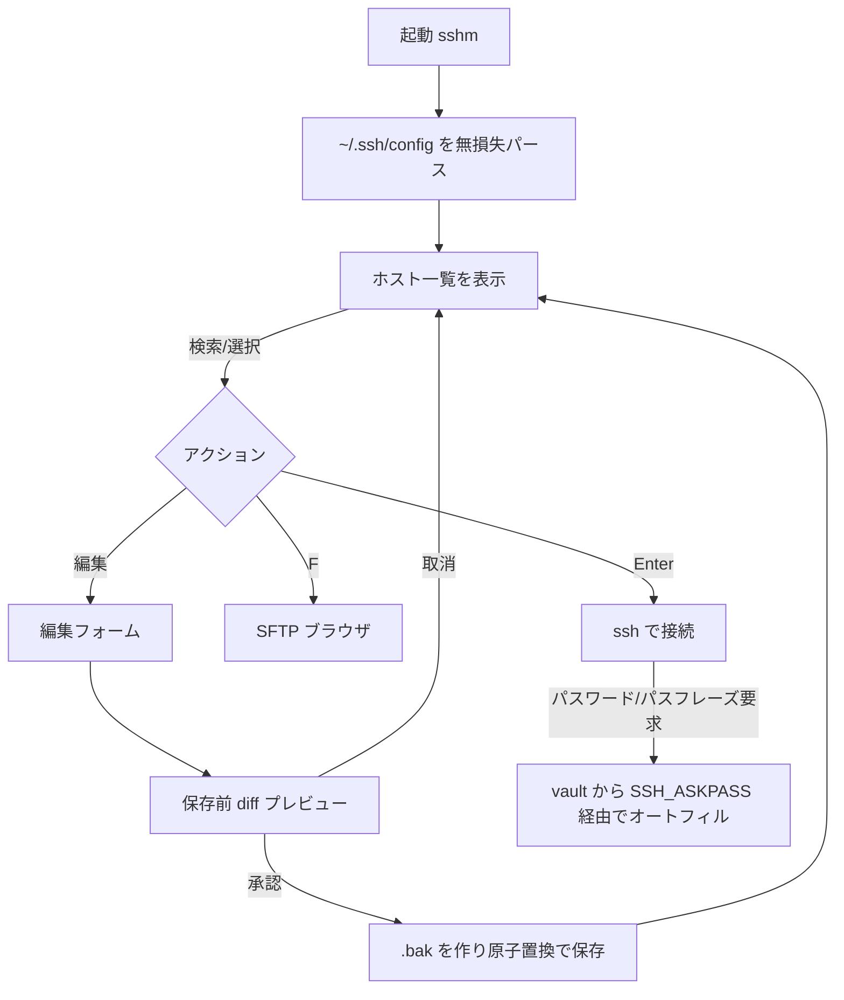

# 要件定義書（sshm-tui）

> このドキュメントは WHAT/WHY（初期合意）の真実源。実装の HOW（最新の設計）は `docs/design/` を、Claude への作業指示は `CLAUDE.md` を参照する。要件が変われば該当節を改訂し「変更履歴」に追記する（現状との乖離は `/project-resync` の整合点検が検出する）。

## 1. 背景・目的

OpenSSH の `~/.ssh/config` は、ホストが増えるほど手編集がつらくなる（別名・HostName・User・Port・IdentityFile・ProxyJump・各種 Forward の把握、接続、鍵の対応関係の確認）。**目的は、多数の SSH ホストを持つ利用者が、閲覧・編集・接続・鍵管理・SFTP 参照を 1 つのターミナル UI（TUI）で完結できるようにすること**。

決定的な制約は **実際の OpenSSH config ファイルを読み書きする**点で、編集は**無損失かつ外科的**（ユーザーが触っていない行はバイト単位で保持）でなければならない。`~/.ssh/config` を単一の真実源とし、保存済みホストは素の `ssh <alias>` で接続する（アプリ独自の接続設定を横に持たない）。

- **想定ユーザー／アクター**: SSH を日常的に使う開発者・システム管理者。**ローカル単一ユーザー**を前提とし、マルチユーザー・権限ロール・サーバ側アカウントは持たない（すべて実行ユーザー自身の権限で、そのユーザーの `~/.ssh` に対して動く）。
- **利用文脈**: **Windows-first**（Git/MSYS の `ssh` 差異、`System32\OpenSSH` 優先、`wt.exe` 新規タブ接続を織り込む）だが、Linux・macOS でもクロスプラットフォームに動く。

## 2. スコープ

**やること**

- ホスト一覧の閲覧（ファジー検索）・編集フォーム・追加・削除
- **保存前の差分（diff）プレビュー**（実 config への変更を可視化してから保存）
- 接続: `ssh <alias>`／`sftp`、Windows は `wt.exe` 新規タブ、アドホックな接続オーバーライド
- SSH 鍵の発見とペアリング（公開/秘密のフィンガープリント照合）
- `known_hosts` の閲覧・管理
- **SFTP ブラウザ**（リモートディレクトリの参照・転送）
- **暗号化 vault**（per-host のログインパスワード・鍵パスフレーズを Argon2id + XChaCha20-Poly1305 で保存）と**接続時オートフィル**（SSH_ASKPASS 経由）
- 到達性プローブ（liveness）・接続履歴・クリップボード連携

**やらないこと**

- サーバ機能・常駐サービスではない（起動中の TUI プロセスのみ）
- `ssh`/`sftp` を越えるリモート構成管理・オーケストレーションはしない
- config のクラウド同期・共有はしない（ローカルファイルのみ）
- **秘密情報を SSH config に書かない**（vault は完全に別ファイル `~/.ssh/sshm-vault.json`）

## 3. 主要機能

| 機能 | 概要 |
|------|------|
| ホスト一覧・検索 | `nucleo-matcher` によるファジーランク検索。到達性・recent ソート |
| 編集フォーム | Host/HostName/User/Port/IdentityFile/ProxyJump/各 Forward/追加オプションを編集。専用フィールド外は `extras` で round-trip |
| 保存前 diff プレビュー | 行レベル差分（共通接頭辞/接尾辞トリム + 行 LCS）で変更を確認してから原子保存 |
| 接続 | `ssh <alias>`／`sftp`、Windows は `wt.exe` 新規タブ、アドホック override |
| 鍵の発見・ペアリング | `~/.ssh` を再帰探索し公開/秘密をフィンガープリント照合（秘密鍵本体は読まない） |
| known_hosts 管理 | 大小無視の部分一致検索・閲覧・書き換え |
| SFTP ブラウザ | 短命 `sftp -b` op をワーカースレッドで実行、armed オートフィル + circuit-breaker |
| vault ＋ オートフィル | Argon2id + XChaCha20-Poly1305 の暗号化ストア。接続時に SSH_ASKPASS 経由で解放 |
| 到達性プローブ | ワーカースレッドプールで非ブロックに TCP 到達性を確認 |
| 接続履歴 | alias→最終接続時刻（上限付き・fail-soft） |

## 4. 業務フロー

主要ユースケース（起動 → 接続 / 編集保存）:

## 5. 非機能要件

- **対象環境**: Windows-first（クロスプラットフォーム）。Rust edition 2024・MSRV `rust-version = "1.94"`。OpenSSH（`ssh`・`ssh-keygen`）が PATH にあること。新規タブ接続は `wt.exe` を要する。
- **セキュリティ**（本プロジェクトの中核的非機能）:
  - 秘密（パスワード・パスフレーズ）は SSH config に置かず、専用 vault（`~/.ssh/sshm-vault.json`）に **Argon2id + XChaCha20-Poly1305（AEAD）**で暗号化して保存。マスターパスワードは永続化しない。KDF パラメータは復号前に範囲チェック（DoS・弱体化を防ぐ）。
  - 秘密は `Secret`/`Zeroizing` で扱い、drop 時にスクラブ・`Debug` で redact。アイドル 15 分で自動ロック。
  - ファイルは owner-private（unix `0o600`／Windows は継承除去した owner-only ACL）・O_EXCL 一時名・fsync。
  - オートフィルの解放は **System32 由来の信頼ゲート**（`GetSystemDirectoryW` で解決）で門番する。
- **定量目標**: **該当なし**（インタラクティブなローカル TUI のため SLA 的な数値目標は持たない）。実装上の応答性は「UI スレッドを非ブロックに保つ（200ms tick で liveness/SFTP をドレイン）」方針で担保する。
- **データ保護**: 収集する個人情報・テレメトリは無し。vault が保持するのは利用者自身の秘密のみ（保存時暗号化・ローカル限り）。
- **バックアップ/DR（RPO/RTO）**: **該当なし**（ローカルデスクトップツール。`~/.ssh` のバックアップは利用者の責任）。ただし config 保存時に**一度きりのセッションバックアップ（`.bak`）**を作る。
- **監視方針**: **該当なし**（常駐サービスではないローカルツール）。
- **i18n・タイムゾーン**: UI は英語。接続履歴のタイムスタンプはローカル時刻で扱う。

## 6. テスト方針

体系は `.claude/rules/testing-strategy.md`。本プロジェクトで実施するレベル:

- **単体（TDD）**: Red-Green-Refactor。`config/`・`os/` のファイル内に inline `#[cfg(test)]`（現在 260 テスト）。回帰テストはコメントでバグ id（B1・B5 等）を付けて保存する。大半は純粋だが、`os::resolve` の一部テストは実 `ssh -G`・`ssh-keygen -H` を spawn する（ランナーに OpenSSH が要る。cold な Windows で稀にタイムアウトしてフレークするため再実行か hardening が要る）。
- **E2E（TUI）**: tmux + winpty で `sshm.exe` を headless 駆動する（send-keys）。フレームは重なるため**画面ではなくファイルで検証**し、vault を伴うテストは実ファイルを退避 → sha256 → 復元してバイト単位の非破壊を確認する。
- **セキュリティレビュー**: リリース前の一段として、多段・敵対的なセキュリティレビュー（vault crypto・askpass・System32 信頼ゲート・connect パス等）を実施し、実装との整合を確認する（`security-reviewer`／`windows-first-reviewer`）。
- **依存監査**: `cargo audit`（RUSTSEC アドバイザリ・yanked）と `cargo deny check`（サプライチェーンゲート・`deny.toml`）を正式な品質ゲートとして回す。CI にも組み込む。
- **性能テスト**: 大量ホスト（数千件規模の config）でのパース・描画応答性を確認する性能テストレベルを持つ。**合否ライン（具体的な目標値・データ規模）は未確定**（「未決事項」参照）。
- **受入（UAT）・結合の分離**: ソロ OSS のため UAT は無し。結合テストは単体に統合する（`commands.integrationTest` は未設定）。

CI（`.github/workflows/ci.yml`）は Linux・Windows のマトリクスで `cargo fmt --all -- --check`・`cargo clippy --all-targets -- -D warnings`・`cargo test --all`・`cargo audit` を回す。

## 7. 技術選定

| 領域 | 選定 | 理由 |
|------|------|------|
| 言語 | Rust（edition 2024, MSRV 1.94） | 単一バイナリ配布・メモリ安全・OS 連携。秘密のゼロ化を型で担保 |
| TUI | `ratatui` 0.30 | 成熟した Rust TUI。テーマ（Tokyo Night）・レスポンシブレイアウト |
| 暗号 | `argon2` + `chacha20poly1305` + `zeroize` | vault の KDF（Argon2id）・AEAD（XChaCha20-Poly1305）・秘密のスクラブ |
| 乱数 | `getrandom` | CSPRNG（salt・nonce・不予測な一時名） |
| 検索 | `nucleo-matcher` | ホスト一覧のファジーランク |
| その他 | `arboard`（クリップボード）・`dirs`（パス解決）・`serde`/`serde_json`（vault/prefs/history）・`anyhow`/`thiserror`（エラー） | — |
| Windows | `windows-sys` | System32 解決・owner-only ACL・コンソール制御 |

アーキテクチャ（レイヤリング・無損失 round-trip 不変条件など）の詳細は `CLAUDE.md`「プロジェクト固有情報」節と `docs/design/` を参照。

## 8. リリース・運用

- **提供形態**: 無償 OSS（ライセンス `MIT OR Apache-2.0`）。収益化は GitHub Sponsors のみ（有償機能・課金は行わない方針）。
- **配布**: crates.io（クレート名 `sshm-tui`／バイナリ名 `sshm`）・Scoop・winget（マニフェストは `packaging/`）。
- **リリース手順**: 利用者起動の `/release` ランブック（`.claude/skills/release/SKILL.md`）= version bump → 品質ゲート → release build → `v*` タグ → GitHub Release（`.github/workflows/release.yml` がタグ起点でビルド）。副作用があり **user-only**。
- **データ移行**: **該当なし**（ローカルツール・既存データの移行対象なし）。

## 9. 未決事項

| 項目 | 現在の仮置き | 確認先・時期 |
|------|------------|-------------|
| 性能テストの合否ライン（目標値・データ規模） | 未確定。まずは「大量ホストでも描画/パースが破綻的に遅くならない」を回帰観点として置く | 性能テストレベルを実装する Issue の着手時に、実測を基に閾値を決める |

> 監視・バックアップ/DR・定量目標・データ移行は、いずれも本文で「該当なし」と確定済み（デフォルト適用ではなく合意）。解消済みのためこの表には残さない。

## 10. 変更履歴

| 日付 | 変更内容 | 合意者 |
|------|---------|--------|
| 2026-07-14 | 初版作成（`/project-setup` の既存プロジェクト導入。README・CLAUDE.md・コードベースを種に軽量作成。テスト方針は E2E TUI・セキュリティレビュー・依存監査・性能テストを明記） | nakata5577 |
